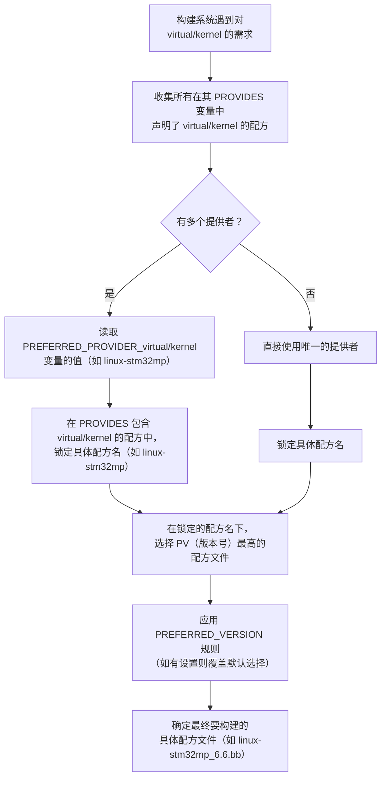

**整个指南并不是从一般到特殊，系统性地针对yocto工程改造的指南，而是根据我在整个流程中遇到的各种疑惑与问题，整理的一份文档。整个指南会根据我的深入逐渐丰富，为之后想要上手yocto工程的新手提供一些帮助。**

# Vim 基本操作


## 3种核心模式


**命令模式（默认模式）**

打开文件后默认进入此模式，可执行光标移动、复制、删除等操作（不能直接输入文字）。

- 按 `i` 进入**插入模式**（可输入文字）
- 按 `Esc` 退回命令模式
- 按 `:` 进入**末行模式**（执行保存、退出等命令）


## 常用光标移动(命令模式)

| 操作            | 说明                                |
| --------------- | ----------------------------------- |
| `h`/`j`/`k`/`l` | 左 / 下 / 上 / 右移动（替代方向键） |
| `gg`            | 跳至文件开头                        |
| `G`             | 跳至文件结尾                        |
| `nG`（如 `5G`） | 跳至第 n 行                         |
| `w`/`b`         | 按单词向前 / 向后跳                 |
| `^`/`$`         | 跳至当前行首 / 行尾                 |


## 复制与粘贴(命令模式)

1. **复制(yank)**

| 操作              | 说明                    |
| ----------------- | ----------------------- |
| `yy`              | 复制当前行              |
| `nyy`（如 `3yy`） | 复制从当前行开始的 n 行 |
| `y$`              | 复制从光标到行尾的内容  |
| `y^`              | 复制从光标到行首的内容  |
| `yw`              | 复制从光标到单词结尾    |


2. **粘贴(put)**

| 操作        | 说明                   |
| ----------- | ---------------------- |
| `p`         | 粘贴到光标后（下一行） |
| `P`（大写） | 粘贴到光标前（上一行） |


3. **与系统剪贴板交互**

如果需要和 MobaXterm 本地剪贴板互通（如复制到 Windows 记事本），需使用：

- `"+y`：复制选中内容到系统剪贴板（需先按 `v` 进入可视模式选中内容）
- `"+p`：粘贴系统剪贴板内容到 VIM


## 搜索与替换(命令模式/末行模式)

1. **搜索(命令模式)**

| 操作                     | 说明                             |
| ------------------------ | -------------------------------- |
| `/关键词`（如 `/error`） | 从光标处向下搜索关键词           |
| `?关键词`（如 `?error`） | 从光标处向上搜索关键词           |
| `n`                      | 跳至下一个匹配结果               |
| `N`                      | 跳至上一个匹配结果               |
| `:set ic`                | 开启大小写不敏感搜索（末行模式） |
| `:set noic`              | 关闭大小写不敏感搜索             |


2. **替换(末行模式)**

| 操作                   | 说明                                    |
| ---------------------- | --------------------------------------- |
| `:s/旧内容/新内容`     | 替换当前行第一个匹配的 “旧内容”         |
| `:s/旧内容/新内容/g`   | 替换当前行所有匹配的 “旧内容”           |
| `:%s/旧内容/新内容/g`  | 替换整个文件所有匹配的 “旧内容”         |
| `:%s/旧内容/新内容/gc` | 替换时逐处确认（按 `y` 确认，`n` 跳过） |


## 其他常用操作

| 操作              | 说明                       |
| ----------------- | -------------------------- |
| `dd`              | 删除当前行                 |
| `ndd`（如 `2dd`） | 删除从当前行开始的 n 行    |
| `u`               | 撤销上一步操作             |
| `Ctrl + r`        | 重做（反撤销）             |
| `:w`              | 保存文件（末行模式）       |
| `:q`              | 退出（末行模式，未修改时） |
| `:wq` 或 `ZZ`     | 保存并退出                 |
| `:q!`             | 强制退出（不保存修改       |


# SVN 仓库

在Ubuntu中建立与SVN仓库的联系：

```bash
svn checkout [SVN服务器地址] [本地目录]
```


这里我主要是用SVN仓库中的STM32目录：

```bash
svn checkout https://192.168.1.77/svn/svn/Cabin_SW/trunk/PLATFORM/ARM_PLATFORM/STM32 ~/svn-workspace
```


## SVN 基本操作

| 操作目的               | 命令                                             | 说明                                                         |
| ---------------------- | ------------------------------------------------ | ------------------------------------------------------------ |
| 查看工作区状态         | `svn status` 或 `svn st`                         | 显示修改、新增、删除的文件（`M`= 修改，`A`= 新增，`D`= 删除） |
| 更新本地仓库到最新版本 | `svn update` 或 `svn up`                         | 拉取服务器最新内容，同步本地                                 |
| 提交修改到服务器       | `svn commit -m "提交说明"` 或 `svn ci -m "说明"` | 必须填写提交说明（`-m` 后的内容）                            |
| 添加新文件到版本控制   | `svn add 文件名/目录`                            | 新增文件后需执行此命令，否则提交时会忽略                     |
| 删除文件并同步到服务器 | `svn delete 文件名` 或 `svn rm 文件名`           | 会同时删除本地文件，需后续提交生效                           |
| 查看提交历史           | `svn log`                                        | 显示所有提交记录（版本号、作者、时间、说明）                 |
| 查看文件具体修改内容   | `svn diff 文件名` 或 `svn di 文件名`             | 对比本地修改与服务器版本的差异                               |
| 撤销本地未提交的修改   | `svn revert 文件名`                              | 恢复到上次更新 / 提交的状态（谨慎使用）                      |


# 深入了解yocto

## yocto配方的默认任务链

```
1. do_fetch
2. do_unpack
3. do_patch
4. do_configre
5. do_compile
6. do_insatall
7. do_package
8. do_rootfs
```

现在来分析每一个任务的细节。

* `do_fetch`：获取源码/补丁
  * 执行目录：无固定目录
  * 核心操作：从`SRC_URI`定义的地址(HTTP/GIT/SVN/本地文件)下载源码包、补丁、配置文件等，并且进行校验
  * 输出目录：`${DL_DIR}`：存放源码包，Git仓库，补丁文件
  * 文件形态：原始的压缩包/裸Git仓库，未解压、未修改
  * 关键变量：`DL_DIR`，`SRC_URI`，`SRCENV`。
* `do_unpack`：解压/检出源码
  * 执行目录：`${WORKDIR}`
  * 核心操作：
    * 压缩包：解压到`${S}`
    * Git：从`${DL_DIR}`的裸仓库检出源码到`${S}`
    * 补丁/本地文件：复制到`${WORKDIR}`
  * 输出目录：`${S}`：源码目录(`.c`/`.h`/Makefile/`configure`等)
  * 文件形态：得到解压后的可读源码
  * 关键变量：`S`，`WORKDIR`，`SRC_URI`。
* `do_patch`：打补丁
  * 执行目录：`${S}`，源码根目录，补丁直接打到源码中
  * 核心操作：
    * 从`FILESPATH`(层的`files`目录)或`${DL_DIR}`读取补丁
    * 按照`SRC_URI`顺序应用补丁(后者会覆盖前者)
    * 支持自定义`do_patch_append`扩展
  * 输出目录：`%{S}`
  * 文件形态：打补丁后的源码
  * 关键变量：`S`，`FILESPATH`(查找补丁的路径，需注意)，`PATCHTOOL`(默认是`patch`)
* `do_configure`：配置编译参数
  * 执行目录：`${B}`，编译目录
  * 核心操作：(这里针对Kernel和Uboot)
    * 加载基础配置，生成`${B}/.config`
    * 合并`.cfg`文件，叠加到`${B}/.config`上
    * 补全默认配置，自动补全`.config`中未定义的配置项
  * 输出目录：`${B}`
  * 文件形态：基础`defconfig`+`cfg`合成`.config`
  * 关键变量：`KBUILD_DEFCONFIG`(默认使用的配置文件)
* `do_compile`：编译
  * 执行目录：`${B}`
  * 核心操作：执行`make`，编译源码生成目标文件(`.o`)、可执行文件、库(`.so`/`.a`)
  * 输出目录：`${B}`下的配置文件+`${S}`下的源码变为`${B}`下的编译产物
  * 文件形态：二进制文件(包含目标文件等中间产物)
  * 关键变量：`B`，`CC`(编译器)
* `do_install`：安装到伪跟文件系统
  * 执行目录：`${B}`
  * 核心操作：
    * 执行`make install`，将编译产物安装到`${D}`下
    * 自定义安装：可以手动复制文件
  * 输出目录：`${D}`下按照文件系统结构组织的文件
  * 文件形态：按系统目录结构部署的文件(与最终的`rootfs`目录一致)
  * 关键变量：`D`，`prefix`
* `do_package`，`do_rootfs`：打包，生成镜像
  * `do_package`在`${WORKDIR}`下解析`${D}`中的文件并打包
  * `do_rootfs`将所有选中的包安装到`${IMAGE_ROOTFS}`，生成完整的根文件系统，最终打包为镜像，输出到`${DEPLOY_DIR_IMAGE}`

这里的变量都可以通过`bitbake -e`进行查询，不过比较麻烦的是可能我们并不知道这些变量具体在哪里定义的。

## 关键的配方目录

yocto配方有几个关键的目录：`${WORKDIR}`，`${B}`，`${S}`，$`{D}`

在yocto中，每一个配方都围绕这几个核心的变量展开，他们决定了配方在构建时的工作空间和文件流向。不清楚的话，可以利用

```bash
bitbake <my-recipe> -e | grep "^S= | ^D= | ^B= | ^WORKDIR="
```

来查看这些变量的最终生效值。

> `WORKDIR`：配方的工作目录，默认为`build/tmp/work/${MULTIMACH_TARGET_SYS}/${PN}/${EXTENDPE}${PV}-${PR}`
>
> `S`：源码目录，存放解压、检出后的原始(打补丁后)源码，默认为`${WORKDIR}/${PN}-${PV}`(压缩包)或者`${WORKDIR}/git`(git源码)，在配方中可以覆盖
>
> `B`：编译目录(Out-of-Tree 编译)，存放配置/编译的中间产物，默认为`${WORKDIR}/build`；也有直接在源码下编译的`${S}`(In-Tree 编译)
>
> `D`：安装目录(伪根文件系统)，编译产物先安装到这里，是打包的基础，默认为`${WORKDIR}/image`

这些变量的基础定义在yocto的核心层(`poky/meta/conf/bitbake.conf`)


## 任务标记

在自定义配方时，常常会对`task`进行一些标记或重定义。比如我们要使用本地的源码，可能就不需要再进行`do_patch`或者`do_configure`了，那么这时我们就会用到任务标记`Varflags`，这种标记的用法为：

```bash
do_<task_name>[Varflags] = "1"
```

而主要使用的任务标记有：

| 标记名           | 作用                                                         |
| ---------------- | ------------------------------------------------------------ |
| `noexec`         | **不执行该任务**。任务保留依赖关系，但内容不运行（相当于空任务）。常用于 placeholder 或禁用默认行为。 |
| `nostamp`        | **不创建 stamp 文件** → BitBake 总是认为任务 *“未执行”*，因此每次都执行。 |
| `network`        | 允许任务访问网络（默认只有 fetch 允许）。                    |
| `lockfiles`      | 为任务设置锁文件，使多个任务互斥执行。                       |
| `number_threads` | 限制任务运行时使用的线程数（控制并行）。                     |
| `dirs`           | 任务开始前需要创建的目录列表。                               |
| `depends`        | 为任务添加额外依赖，比如 task1 必须在 task2 之后执行。       |


## 奇妙的等号

在`yocto`和`makefile`中都有变量与赋值，而赋值的手段不仅仅只有`=`，还有一些变种：

| 写法  | 名称（常用叫法） | 什么时候展开      | 类比 Yocto     |
| ----- | ---------------- | ----------------- | -------------- |
| `=`   | 递归展开（延迟） | **使用时**        | `=`            |
| `:=`  | 简单展开（立即） | **定义时**        | `:=`           |
| `?=`  | 条件赋值         | 如果未定义        | `?=`           |
| `+=`  | 追加             | 立即/延迟依上下文 | `+=`           |
| `::=` | GNU make 扩展    | 很少用            | （Yocto 很少） |


# VScode 远程连接开发


使用MobaXterm+VIM也可以直接在终端中实现yocto工程的各种文件编辑，但是终究比较麻烦并且在修改代码时也不方便，于是我考虑使用本地的VScode+SSH远程连接虚拟机来进行工程的修改。

VScode是一款轻量化的代码编辑器，拥有着丰富的插件库。我不仅可以SSH连接虚拟机，还可以安装yocto工程相关的插件来实现图形化的构建与调试。

## SSH 配置

在本地VScode上安装`remote SSH`相关的插件，界面的左边就会有`远程资源管理器`

可以通过`Ctrl+Shift+P`并键入`Remote-SSH`来更新我们的SSH配置文件，我们优先去更改自己用户的`.ssh`文件，一般位于`C:\Users\username\.ssh\config`。

根据我们的虚拟机IPv4地址和用户名，在`config`中添加：

```bash
Host ubuntuvm			# 给虚拟机起一个别名，方便记忆
Hostname 192.168.x.x	# 虚拟机的IP地址
User vm-username		# 虚拟机的用户名 
```

配置好以后我们就可以`Ctrl+Shift+P`：输入`Remote-SSH: Connect ...`来用命令连接虚拟机，也可以直接用GUI选项连接。


还需要注意虚拟机这边的一些配置：

```bash
sudo apt update && sudo apt install openssh-server # 下载ssh服务
sudo systemctl start ssh # 开启并设置ssh服务开机自启
sudo systemctl enable ssh
sudo systemctl stop ufw # 关闭防火墙
sudo systemctl disable ufw 
```


由于虚拟机有用户名和密码，每一次连接时就需要输入密码，非常的繁琐。我们可以通过使用SSH密钥来进行认证。


首先在Win主机上生成一个SSH密钥对：

`Win+R`:`cmd`或者`powershell`打开终端，输入以下命令生成密钥：(邮箱可以替换为任意的标识信息)

```bash
ssh-keygen -t rsa -b 4096 -C "your_email@example.com"
```

接着会提示为密钥设置"通行短语"，为了免密登录，我们只需要按回车 留空就好，这样就会生成一个无通行短语的密钥对。

完成后我们就可以在用户的`.ssh`目录下得到两个文件：

```
id_rsa		# 私钥 需要严格保密
id_rsa.pub	# 公钥
```

然后我们需要将公钥上传至虚拟机：

在本地查看`id_rsa.pub`公钥的内容，并完整复制。通过各种方式登录虚拟机(比如MobaXterm)，进入`~/.ssh/`目录，没有可以自行建立，然后将复制的公钥内容追加到`~/.ssh/authorized_keys`文件末尾。

然后为该目录和文件设置正确的权限：

```bash
chmod 700 ~/.ssh
chmod 600 ~/.ssh/authorized_keys
```

还要注意`~`目录，也就是`/home/user_name`目录的权限：

```bash
chmod 755 /home/user_name
```


# yocto 工程的迁移


## 从联网机到服务器虚拟机

这里以之前在本地虚拟机的一个yocto工程为例来为新手讲解如何整理一个构建过镜像的yocto工程，只保留源码来快速迁移。

在构建镜像时使用：

```bash
bitbake --runall=fetch st-image-*
```

来只是进行`do_fetch`操作，仅仅下载源码。而后将`build`目录下多余的文件全部清理，比如`tmp/`等，仅保留`conf/`目录，如果没有修改`DL_DIR`（在`local.conf`中修改），那么还需要保留`downloads/`目录。

利用移动硬盘等工具将整个工程打包迁移到开发机上，就完成了基本的迁移。


**注意**：Linux的拷贝没有那么简单！

习惯了Windows下的拷贝，如果跨机器拷贝仅仅是通过`cp`，那么会丢失很多关键信息，比如文件属性，遗漏隐藏文件，传输损坏等... 我们如果直接粗暴的利用`cp`命令迁移工程，那么在目标虚拟机中想要执行构建一定会遇到问题。

因此需要进行“打包-迁移”

```bash
tar -zcvpf yocto.tar.gz yocto/
```

- 参数解释：
  - `-z`：用 gzip 压缩（减少体积，方便传输）；
  -  `-j`：用 bz2 压缩；
  - `-c`：创建压缩包；
  - `-x`：解压压缩包；
  - `-v`：显示打包过程（可选，方便确认）；
  - `-p`：**保留所有文件权限和所有者**（核心参数，避免权限丢失）；
  - `-f`：指定压缩包名；
  - `stm32/`：要打包的工程目录（包含 build、sources、downloads）。

然后再将压缩包拷贝到硬盘中，打包好的压缩包传输不会损失信息。再解压：

```bash
tar -zxvpf yocto.tar.gz
# 修复所有者（如果源机与目标机uid不同
sudo chown -R $(id -u):$(id -g) ~/yocto
```


## 工程中的路径修改


注意`build/conf`中的`local.conf`和`bblayers.conf`两个配置文件，有没有涉及到绝对路径。如果有的话需要进行对应的修改。


（每一次迁移都需要去修改，感觉很麻烦... 有没有什么自动化的方法来管理...


这里请看`7.4 强大的脚本`。


##  初始化脚本


`poky/`目录提供了bitbake的初始化脚本`oe-init-build-env`，该脚本会在当前终端初始化bitbake，并且会创建yocto工程的构建目录`build/`并跳转至该目录下, 这个目录如果不加定义会创建在`poky/`目录下。这显然不符合我们的工程结构，因此每一次需要：

```bash
source sources/poky/oe-init-build-env build/
```

而每次打开一个新的终端都需要重新运行该脚本，稍不注意就可能在`poky/`目录下再创建一个`build/`。有没有更好的办法呢？使得我们直接在构建目录内就可以初始化，并且不用输入繁复的地址指令？

我们可以在构建目录下创建一个新的脚本用于初始化环境。

该脚本可以继承`oe-init-build-env`脚本，然后还可以自定义一些配置。


这里给出了一个通用的初始化脚本，它被放在`./build/`构建目录下，我们可以直接运行该脚本来初始化构建环境并进入构建目录，不要求当前目录。

```bash
#!/bin/bash

# 动态获取工程根目录（my-yocto目录）
# 脚本位于build目录下，因此上一级即为工程根目录
PROJECT_ROOT=$(cd "$(dirname "${BASH_SOURCE[0]}")/.." && pwd)

# 定义必要路径（基于你的工程结构）
OE_INIT_SCRIPT="${PROJECT_ROOT}/sources/poky/oe-init-build-env"
BUILD_DIR="${PROJECT_ROOT}/build"

# 错误检查：确保初始化脚本存在
if [ ! -f "${OE_INIT_SCRIPT}" ]; then
    echo "错误：未找到oe-init-build-env脚本，路径：${OE_INIT_SCRIPT}"
    echo "请确认工程结构是否符合预期：${PROJECT_ROOT}/sources/poky/"
    exit 1
fi

# 错误检查：确保build目录存在
if [ ! -d "${BUILD_DIR}" ]; then
    echo "错误：build目录不存在，路径：${BUILD_DIR}"
    exit 1
fi

# 自动切换到build目录
echo "切换到构建目录：${BUILD_DIR}"
cd "${BUILD_DIR}" || {
    echo "错误：无法切换到build目录"
    exit 1
}

# 执行官方环境初始化脚本
echo "正在初始化yocto构建环境..."
source "${OE_INIT_SCRIPT}" "${BUILD_DIR}"

# 传递DL_DIR和SSTATE_DIR环境变量（如果已设置）
if [ -n "$DL_DIR" ]; then
    BB_ENV_PASSTHROUGH_ADDITIONS="$BB_ENV_PASSTHROUGH_ADDITIONS DL_DIR"
fi
if [ -n "$SSTATE_DIR" ]; then
    BB_ENV_PASSTHROUGH_ADDITIONS="$BB_ENV_PASSTHROUGH_ADDITIONS SSTATE_DIR"
fi
export BB_ENV_PASSTHROUGH_ADDITIONS

# 清除模板配置变量，确保使用当前build/conf目录的配置
unset TEMPLATECONF

echo "环境初始化完成！"

```

该脚本只要保证工程的总体结构是一致的：
```bash
工程根目录/
├── build/                  # 构建目录（脚本存放位置）
└── sources/
    └── poky/
        └── oe-init-build-env  # 官方初始化脚本
```

那就可以实现复用。

另外在脚本的末尾还有一些自定义的变量，用于特殊的情况。目前我还用不到。

比如对`BB_ENV_PASSTHROUGH_ADDITIONS`变量的设置，一般是用于临时覆盖某些变量比如`DL_DIR`，这时候改变量将不采用`local.conf`中设置的值，而是直接使用环境变量中的值，较为灵活。


**在`7.4`中有一个更强大的脚本，我们直接修改那个脚本，就可以自动生成这里的脚本来初始化。**


## 验证：本地构建yocto 模板工程

完成了yocto工程的迁移后，在服务器虚拟机上有了用于构建镜像的完整源码文件。

这里配方中对应的程序源码都放在`downloads/`目录下，这个目录可以通过修改`local.conf`中的`DL_DIR`变量来自定义。

此时我们的源码都放在虚拟机本地，只要在构建时能够找到该目录，构建脚本就会跳过下载而直接使用本地源码。（还未涉及到SVN）

另外在运行`bitbake <recipe>`命令时，yocto总是会进行联网检查，要是未通过还会报错。可以在`local.conf`添加环境变量：

```bash
BB_NO_NETWORK = "1"
```

这样就会禁用网络检查。

此时我们以最简单的`core-image-minimal`为例，就可以直接进行本地构建了：

```bash
bitbake core-image-minimal
```

**这里只是做一个初步的验证，后续禁用网络的配置会删除。**


# 按照规范修改整改工程

## yocto工程结构规范

yocto工程的格式通常为

```bash
yocto
├── build
| ├── conf
| └── init-build-env
└── sources
  ├── meta-mylayer
  ├── ...
  └── poky
```

一般厂商提供的和官方给的一些软件层都会放在`sources/`目录下，比如`meta-rockchip`，`meta-qt6`等等。

根据根据需求我们会对这些官方的配方进行修改或添加，但是为了可维护性，我们通常在`sources/`目录下单独创建一个自己的层来存放修改的文件，比如这里的`meta-mylayer`，实际上我们是按照软件室的规范来构建这个自定义层。

目前将资源都上传至SVN，根据需要拉取，而因为yocto项目版本间存在兼容性问题，因此在SVN上其实同时存在多个版本，最主要的就是`poky/`的不同。另外就是适配的一些厂商的BSP层和软件官方层的适配，因此在SVN上，是单独将每个版本及其对应的`poky`层以及当时构建项目用到的BSP层等等打包放在了一个地方。

结构类似于：

```
platform
├── 1.8.1
| └── ...
└── 5.0.11
  ├── meta-rockchip
  ├── ...
  └── poky
```

这里的`1.8.1`，`5.0.11`都是yocto的版本号，对应着不同的`poky/`。

注意到了吧，这里并没有包含我们根据具体工程而创建的自定义层。SVN将自定义层单独放置在了另一个目录下进行管理，并有着相对统一的组织结构。这里随便以一个项目为例：

```bash
meta-cetca
├── meta-etu
| ├── meta-bsp
| | ├── conf
| | | ├── machine
| | | └── layer.conf
| | ├── recipes-bsp
| | ├── recipes-core
| | ├── recipes-kernel
| | └── ...
| └── meta-sdk
|   ├── conf
| | | ├── distro
| | | └── layer.conf
| | └── recipes-cetca
└── meta-avod
  └── ...
```

根目录，就是自定义层`meta-cetca`，然后在其中我们按照不同的项目分别创建各自的层，按照项目名称来，比如`meta-etu`或者`meta-avod`。

一般情况下我们会去改动内核和U-boot的源码，并且会自定义生成可以烧录的系统镜像以及其中的开发工具。因此每一个项目的层中主要有：

> * `meta-bsp`：包含kernel，u-boot以及与硬件紧密相关的修改后的配方，还会存放machine配置文件
> * `meta-sdk`：包含发行版配置，与SDK相关的配方，比如后续的rootfs以及大镜像的配方都放在这里

这里的`meta-sdk`我们可能还暂时没有涉及到，但是BSP相关的其实我们已经有些熟悉了，之前我们已经走通了源码上SVN的kernel和uboot的构建。尝试编写了最基础的`.bbappend`配方。我们自己写的`.bbappend`文件就会存放在`meta-cetca/meta-bsp/recipes-bsp/`中，注意结构也需要和硬件厂商的结构一致，保证能够找到。比如我们基于`meta-rockchip/recipes-bsp/u-boot/u-boot-rockchip.bb`修改，那么我们的`.bbappend`文件结构就是`meta-cetca/meta-bsp/recipes-bsp/u-boot/u-boot-rockchip.bbappend`。**这里因为嵌套了多个层，但是我们只需要注意在`bblayers.conf`中加入最里面的层，这里就是`meta-cetca/meta-bsp/`**。

## 将已有的yocto工程进行简单整改

如果自己进行构建的话就可以按照上述方式来构建，避免后期进行大规模整改。但是这里我们需要将前辈已经搭建好的yocto工程整改为符合规范的结构。前辈的结构比较简单粗暴，他创建了一个自定义层`meta-cetca`，然后就直接在其中加入了很多修改后的配方，结构如下：

```bash
meta-cetca
├── conf
├── recipes-bsp
├── recipes-core
├── recipes-devtools
└── ...
```

可以看到其结构和标准结构有明显不同，我们可能需要对其中的配方目录进行一些移动。

目前来看，对`recipes-kernel`和`recipes-bsp`等配方，直接将其整个移入`meta-bsp`层中，然后更改`bblayers.conf`基本就能够完成迁移。另外比较重要的是`machine`和`distro`的整改。他们都在`meta-cetca/conf/`目录下以独立的目录形式存在。我们也可以直接在`meta-bsp`和`meta-sdk`下创建`conf/`目录，并将其放入。

> 其实可以直接在`meta-avod`下`bitbake-layer create layer meta-bsp`来创建层。其实`meta-cetca`和`meta-<项目名>`在规范中并不是一个yocto意义中的层，只有里面的`meta-bsp`等才是正经的层(他们连`conf`已经层配置文件都不具备)。

我们还需要为`meta-bsp`和`meta-sdk`这些层修改其层配置文件`layer.conf`。这里给出了`meta-bsp`的一个基本的配置。其实可以直接根据前辈的`meta-cetca`的`conf`中的配置文件来修改。(前辈的`meta-cetca`是一个完整意义的层，不同于规范里的`meta-cetca`)

```bash
# We have a conf and classes directory, add to BBPATH
BBPATH .= ":${LAYERDIR}"
# We have recipes-* directories, add to BBFILES
BBFILES += "${LAYERDIR}/recipes-*/*/*.bb \
	    ${LAYERDIR}/recipes-*/*/*.bbappend"
# Set unique name for this layer
BBFILE_COLLECTIONS += "cetca-bsp"
BBFILE_PATTERN_cetca-bsp := "^${LAYERDIR}/"
BBFILE_PRIORITY_cetca-bsp = "10"
# Set layer depends
LAYERDEPENDS_cetca-bsp = "core openembedded-layer rockchip"
# compatible with yocto
LAYERSERIES_COMPAT_cetca-bsp = "scarthgap"
```

这些基本配置更改好后，我们还需要对工程的`build/conf/`下的`local.conf`和`bblayers.conf`进行修改，将新创建的层`meta-bsp`等加入`bblayers.conf`，然后确认`local.conf`中的`distro`和`machine`等能够正确指向新位置的配置文件。

运行`bitbake -p`来解析配方，这条命令能够检查出有效的层路径，配方语法等基础问题。然后就可以尝试构架`virtual/kernel`和`virtual/bootloader`等配方了。如果遭遇报错，可以根据问题进行对应的修改。

## .conf的差异

在一个yocto工程中，存在很多个不同的`.conf`文件，比如在`build/conf`下有着最熟悉的`local/conf`和`bblayers.conf`。而在每一个`meta-*`层目录中也会有一个`meta-*/conf/`目录，下面可能有着`machine/`或者`distro/`目录，其中存放有机器配置或者发行版配置等`.conf`文件。这些文件虽然都是配置文件，但是其**作用范围，设计目的和管理优先级**上都有显著区别。`bblayers.conf`只用于配置该yocto工程启用的`meta`层，而`local.conf`则是一个yocto工程**优先级最高的配置文件**。

优先级按从上到下递增的顺序有：

1. 基础配置(OE-Core)：提供最底层的默认配置。
2. 发行版层(Distro Layer)：我们自定义层中`meta-sdk/conf/distro/xx.conf`就是发行版配置。它会定义我们的镜像的"风味"，具体来说就是我们构建的完整镜像，会包含哪些软件包，实现什么样的功能。
3. BSP层(BSP Layer)：我们的自定义层中`meta-bsp/conf/machine/xx.con`就是BSP层配置。它告诉yocto工程"系统要在什么样的硬件上运行"，负责内核，启动加载，设备树等与硬件强相关的配置，也就是我们说的机器配置。
4. 用户配置(User Conf)：也就是`build/conf/local.conf`，这也是优先级最高的层，允许开发者在不修改项目核心元数据的情况下，临时调整构建参数，可以覆盖以上所有层的信息用于调试。在其中我们还可以选择`MACHINE`和`DISTRO`选择的配置文件，来确定工程的发行版和机器配置。

配置分层实现了**解耦和复用**：镜像用途(sdk)和硬件适配(bsp)可以完全解耦，并且同一个发行版配置可以适配多种不同的硬件，反之亦然。


我可能还对发行版配置和机器配置之间的异同有一些疑惑，这里给出一个对照表：

| 配置维度       | `meta-sdk/conf/distro/xx.conf`(发行版配置)                   | `meta-bsp/conf/machine/xx.conf`(机器配置)                    | `build/conf/local.conf`(本地构建配置)                        |
| :------------- | :----------------------------------------------------------- | :----------------------------------------------------------- | :----------------------------------------------------------- |
| **核心职责**   | 定义**发行版策略**和通用软件栈选择，如包管理、C库、文件系统布局、全局特性等。 | 定义**硬件特定参数**，如CPU架构、内核、启动加载器、设备树、硬件特性等。 | 定义针对**单次构建**的个性化设置和本地环境选项。             |
| **作用范围**   | **全局性**。影响所有基于该发行版构建的机器（Machine）。      | **特定于硬件**。只影响指定的一种或几种机器。                 | **本地构建目录**。仅对当前这个构建目录有效。                 |
| **设计初衷**   | **可复用、可共享**。旨在为一个产品系列或项目定义统一的软件标准和策略。 | **可复用、可共享**。旨在为特定硬件平台提供支持，可与不同的发行版搭配。 | **本地定制、临时调整**。用于开发者覆盖全局设置，进行本地调试和实验。 |
| **优先级覆盖** | 中等。可被 `local.conf`中的设置覆盖。                        | 中等。可被 `local.conf`中的设置覆盖。                        | **最高**。其中的设置通常会覆盖发行版和机器配置中的同名变量。 |
| **版本控制**   | **强烈建议**纳入版本控制。作为项目资产的一部分。             | **强烈建议**纳入版本控制。作为BSP层的一部分。                |                                                              |


看到这里应该对这几个层配置文件有了大概的印象，那么我们如果需要为项目加入配置时，应该去修改哪一个配置文件呢？这里有一个较为基本的原则：

- **放在 `meta-sdk/conf/distro/xx.conf`中**：当某个配置代表了**整个项目统一的、战略性的软件策略**时。例如，规定所有产品都使用 `systemd`作为初始化系统，或者统一使用 `opkg`作为包管理器。
- •**放在 `meta-bsp/conf/machine/xx.conf`中**：当某个配置**直接依赖于硬件特性**时。例如，指定内核版本、U-Boot 的配置文件、GPU 驱动的类型、启动分区的布局等。
- •**放在 `build/conf/local.conf`中**：当某个配置**纯粹是为了本地开发调试**，或者你不确定其长期影响，想先进行测试时。例如，为了快速迭代而禁用某些耗时的安全检查，或者设置代理服务器以下载资源。

`local.conf`主要还是本地配置，用于我们本地构建和调试工程时使用的配置。当我们的项目需要上库，进行版本管理时，一些可以固化的配置信息就可以根据实际情况添加到发行版或者机器配置中。


比如我们接下来可能会涉及到的，修改yocto工程的源码获取方式，从原来的联网下载或者本地缓存，变为从SVN仓库中拉取。这种配置显然不涉及硬件，那么就应该放入`distro`中，而事实上前辈也是如此做的，如果不知道需要写什么，就可以参考SVN仓库中前辈的`distro`配置文件。


## 强大的脚本！

在整改的过程中我发现，直接去修改这些`.conf`文件其实没有那么方便，特别是yocto工程会涉及到很多环境变量，这些变量在移植的过程中路径可能会出问题(从一台电脑到另一台)。另外，yocto工程是非常庞大的，每一次拷贝如果都是拷贝全部效率非常低。这个时候，脚本的强大之处就体现了出来。我们只需要拷贝`sources/`目录，如果是离线环境可能还需要`downloads/`。我们可以通过一个初始化脚本来帮助我们完成一些流程化的配置过程

yocto本身在`poky/`目录下有一个`oe-init-build-env`脚本，它只是完成了最基础的创建`build/`模板和初始化Bitbake，而我们知道`local.conf`和`bblayers.conf`都是在`build/`目录下的(没有拷贝)，显然这个脚本并不能完成我们所需要的功能。

参考前辈的工程，在SVN上有一个统一的工程初始化入口`setup-env`，这个入口也是一个脚本，只是通过不同的选项来为对应项目完成初始化，本质上就是脚本调用脚本。入口脚本会根据项目再调用对应的初始化脚本，比如我的项目脚本就可以叫做`avod-setup-env.sh`。

**因此最关键的脚本其实就是这个`avod-setup-env.sh`！**他会帮助我们在一个陌生的环境中搭建起我们熟悉的工程环境。当然这个环境也需要一些材料，这个之后再说。前辈已经有一个基础的脚本模板了，它似乎是一个基于AGL模板的初始化脚本。我暂时没有对这个模板进行过多的了解。其源码并不复杂(至少前辈修改的那个版本)，主要就是利用脚本去寻找路径并且完成一些自定义的初始化。比如它会用到`.sample`来创建`local.conf`和`bblayers.conf`的模板，并在调用`oe-init-build-env`时用它来覆盖原本的模板，还可以通过添加模板碎片`.conf.inc`来为对应的`MACHINE`来添加配置。

用这种方法我们就可以不用去关注工程目录的绝对路径，省去移植工程时繁琐的修改，直接用初始化脚本来完成这个步骤(整个脚本都是基于工程内部的相对路径，因此在调用脚本时会自动为`.conf`生成合适的绝对路径，不用自己手动修改)。

具体的脚本和修改方式可以直接参考对应的脚本文件，这里不多赘述。对于`avod-set-up-env.sh`，我们更多的是关注开头`AGL_REPOSITORIES`的查询和确定，对`machines`和`features`的查找(很多时候可能没有`features`，但是不影响)，以及最后可能需要添加的一些配置。之间很多部分其实完全不需要修改，因为yocto工程自己的目录结构一般是固定的，后续的脚本主要依靠前面确定的`AGL_REPOSITORIES`和相对路径完成任务。

```bash
public@public-virtual-machine:~/yocto-avod$ source sources/meta-cetca/meta-avod/meta-bsp/tools/avod-setup-env.sh -b build
------------ avod-setup-env.sh: Starting
AGL_REPOSITORIES: meta-avod
DEBUG: Parsing arguments: -b build
Command line arguments: -b build
DEBUG: validating machines list
DEBUG: Machines list has no duplicate.
DEBUG: validating machine rk3568-avod
DEBUG: validating features list
DEBUG: Features list has no duplicate.
DEBUG: validating builddir build
Generating configuration files:
   Build dir: /home/public/yocto-avod/build
   Machine: rk3568-avod
...
```


# 迁移yocto 工程到SVN

## SVN 的版本兼容问题

遇到了奇葩问题...

由于SVN服务器的版本比较老，并且证书也长时间没有更新了，所以在使用较新的Ubuntu和SVN版本时，首次连接SVN仓库会提示这种问题并给出选项：**拒绝**，暂时接受或**永久接受**。

本应是这样，但是我的Ubuntu22.04虚拟机不知为何缺少了**永久接受**这一选项，导致了SVN几乎无法正常使用，要进行任何的操作都必须手动接受证书。

而之前前辈的Ubuntu22.04就可以正常选择永久接受！非常神奇

经过详细的检查，SVN及其依赖包的版本甚至都完全一致，只有Ubuntu的版本差异和内核版本差异...

我的是Ubuntu22.04.5LTS Linux内核版本为：6.8.0-85-generic

前辈为Ubuntu22.04.4LTS Linux内核版本为：6.5.0-35-generic

我选择降级版本，直接安装前辈的内核版本进行尝试。

结果依然不行，再进一步依赖发现：

我们的OpenSSL版本以及CA证书版本存在差异！安全检查有根本差异，新版本变得更严格了...

如果键入`svn checkout`，我的Ubuntu版本会弹出：

```bash
 - The certificate hostname does not match.
 - The certificate has expired.
 - The certificate has an unknown error.
```

而前辈的提示为：

```bash
 - The certificate is not issued by a trusted authority. Use the
   fingerprint to validate the certificate manually!
 - The certificate hostname does not match.
 - The certificate has expired.
```

由于对`unknown error`的容忍度似乎在新的版本变低了，因此SVN隐藏了**永久接受**的选项。

我一开始考虑过很多解决方案，获取并信任证书，回退SVN版本甚至回退内核版本，最后发现这些想要从根上解决问题的办法非常麻烦，而且很可能导致以后的兼容性问题！


最后的解决办法其实就在一开始提出的方法中，通过修改配置文件来忽略证书问题。但是这里其实又有坑...

这里先给出完整的解决方案：

在`~/.subversion/servers`中的`global`字段加入：
```bash
[global]
...
# 保存SVN账户的用户名和凭据，减少重复输入
username = dailybuild
store-auth-creds = yes
# 保留证书信任开关
ssl-trust-server-cert = yes
```

允许SVN保存用户名和凭据，保留证书的信任开关。

然后执行一次相关的命令与SVN仓库交互一下，获取证书等等，比如

```bash
svn list https://192.168.1.77/svn/svn/Cabin_SW/trunk/PLATFORM/ARM_PLATFORM/STM32 
```

这时就会提示我们证书的各种问题：

```bash
验证“https://192.168.1.77:443”的服务器证书时出错:
 - 证书的主机名称不匹配。
 - 证书已过期。
 - 证书发生未知错误。
证书信息:
 - 主机名称: svn-server
 - 有效时间: 自 May  6 08:06:23 2023 GMT 至 May  5 08:06:23 2024 GMT
 - 发行者: svn-server, CABIN, CETCA, CD, SC, CN
 - 指纹: 3E:7C:63:9F:9C:2C:76:F4:7B:92:C3:60:7D:59:99:15:B8:94:A5:7E
(R)拒绝 或 (t)暂时接受 ？
```

有永久接受就选，没有就选暂时。中间可能还会让我们输入本地的账户密码

```
username	public
code		cetca123
```

还会让我们输入SVN的账户与密码

```
username	dailybuild
code		cetcA123
```

注意如果用MobaXterm的话可能需要打开GUI，去输入密码，不然终端会卡住（

完成之后应该会实现第一次与SVN仓库的交互，在本地会保存一些基础的信息。现在为了避免每一次SVN命令都去添加一堆后缀来避免证书的问题，我们可以将其添加到配置文件或全局变量中。

然而这就是一个坑，按理说添加到配置文件中是非常合理的，然而事实上真的把下列代码添加进`server`中会完全不生效：
```bash
ssl-trust-server-cert-failures = cn-mismatch,expired,unknown-ca,other
```

最开始我就因为这个直接放弃了该方法...

最后我们选择使用全局变量的方法，在`~/.bashrc`的末尾添加轻量级别名：
```bash
alias svn='svn --trust-server-cert --trust-server-cert-failures=cn-mismatch,expired,unknown-ca,other'
```

记得在当前终端启用

```bash
source ~/.bashrc
```

这样我们就可以正常使用`svn`命令了，它会自动将这些选项加入。


**另外值得注意的是，这个配置必须在每个虚拟机下单独进行，不能在模板中配置。**


## bitbake+SVN

在正常的命令行中使用SVN遇到的安全证书问题已经得到了解决，但是bitbake在执行`do_fetch`任务时，该环境不会继承原本的别名，因此原来解决的问题又出现了...

在`.bashrc`中添加别名的方式只能解决命令行界面使用svn的问题，但是bitbake构建时使用的svn命令会绕过它，别名不生效

首先我们的yocto工程可能还不支持使用本地的SVN，因此可以在`local.conf`中添加：

```bash
HOSTTOOLS += "svn"
```

这样我们在更改URI后bitbake也能够正确地使用本地SVN去拉取服务器上的代码。

但是这个时候并不代表bitbake使用的SVN命令会使用别名！

我们在改造工程前应该现在本地构建成功，因此在`build/`目录下会有中间文件存放的目录，这里我们需要：

```bash
ls -la build/tmp/hosttools/ | grep svn
lrwxrwxrwx  1 public public   12 10月 21 14:12 svn -> /usr/bin/svn
```

可以看到bitbake调用的是本地的svn二进制可执行文件。我们可以直接对其进行修改来达到目的。


具体做法就是我们创建一个包装脚本，然后该脚本来调用原本的svn可执行文件，这样所有的svn命令都会使用额外的选项。

```bash
# 创建新的包装位置（避免覆盖系统命令）
sudo tee /usr/local/bin/svn-custom << 'EOF'
#!/bin/bash
exec /usr/bin/svn.orig --trust-server-cert --trust-server-cert-failures=cn-mismatch,expired,unknown-ca,other --non-interactive "$@"
EOF

# 设置可执行权限
sudo chmod +x /usr/local/bin/svn-custom

# 创建原始命令备份
sudo cp /usr/bin/svn /usr/bin/svn.orig

# 创建符号链接（指向自定义包装）
sudo ln -sf /usr/local/bin/svn-custom /usr/bin/svn
```

注意我们写的包装脚本在`/usr/local/bin/`下，然后把原本的`/usr/bin/`下的`svn`改为`svn.orig`，并在这个目录下再生成一个`svn`链接到`svn-custom`。这样我们在执行`svn`命令时，其实执行的就是包装脚本。

不过也要注意，我们依然需要先使用一次普通的svn命令来缓存用户名和密码，甚至可能还需要更改一些必要的设置(参考5.1)。然后再来改动这里。

此时我们可以来验证一下：

```bash
ls -la /usr/bin/svn
lrwxrwxrwx 1 root root 25 10月 21 15:31 /usr/bin/svn -> /usr/local/bin/svn-custom

# 测试命令
svn info https://192.168.1.77/svn/svn/Cabin_SW/trunk/PLATFORM/ARM_PLATFORM/STM32/
```

应该能够正常输出SVN仓库对应目录的基本信息。

这样我们就可以在虚拟机中绕过安全证书的检查，正常使用SVN了，bitbake构建时应该也不会因为证书问题报错了。


还有要注意的是，bitbake在解析时使用的是系统本地的SVN，但是bitbake在构建时如果`do_fetch`阶段遇到了SVN的`URI`，那么它会尝试安装一个`subversion-native`来在自己的环境内拉取，**这样会导致我们之前配置好的本地SVN完全失效**！因此我们需要在`local.conf`中额外对这个进行配置：

```bash
# ./build/conf/local.conf
...

# 禁止构建 subversion-native
ASSUME_PROVIDED += "subversion-native"

# 指定使用主机系统的SVN
PREFERRED_PROVIDER_subversion-native = "host-subversion"
```

这样就能够保证在构建阶段bitbake也会使用本地的配置好的SVN运行指令。


##  SVN的三次配置

由于服务器SVN版本过低+证书安全性低+证书过期等一系列原因叠加。导致新版本的SVN和SSL无法像之前一样轻松绕过安全检查。

我一共进行了三次配置，分别针对不同的环境：

1. 为虚拟机终端配置：SVN本地配置+环境变量
2. 为bitbake解析SVN：根目录SVN二进制文件的包装脚本
3. 为bitbake构建时使用SVN：在`local.conf`中配置使用本地SVN

本质上都是为了绕过SVN的安全检查，但是为了找到问题已经如何解决这个问题耗费了大量的时间...

有帮助吗？有一点，这个过程也帮我了解了bitbake的构建的细节。但是代价有点大了...


## SVN最终解决!

上面的这些做法都是治标不治本。因为问题的根源出在SVN服务器上，所以最好的办法就是去更新SVN服务器的证书。根据资料(AI就行)重新自签名一个新的证书，这样在客户端就不会再遇到各种错误了。问题直接解决！不需要去自定义`svn`然后软链接这种麻烦的操作，直接从根上解决了问题。另外yocto也不必再使用本地的svn了，相关的配置可以直接注释掉。

另外就是因为svn的机制问题，似乎无法实现保存密码，每一次敲命令都会要求输入密码。这一点倒是好解决。

我们可以在`~/.bashrc`中为`svn`命令添加别名，直接显式指定用户和密码。而对应Yocto来说也是一样，直接显式指定就好。

至此，SVN的相关问题完美解决~


## yocto 工程本地检查

这里其实要注意，现在的迁移其实不是指将yocto工程的`downloads/`目录给上传到SVN服务器，通过调整配方的URL来从SVN上下载源码。我一开始也以为是这样来实现本地的离线构建，但是在实际操作过程中遇到了很多问题。比如一个系统镜像涉及到的配方文件多大几百个，不管是逐一修改其`.bb`文件中的`URL`还是自定义`meta-`层，通过`.bbappend`来添加`URL`覆盖原有的`URI`，都是一件费时费力的事情。如果是修改`local.conf`文件，配置`MIRROR`路径也会遇到一系列问题。这样的改造有些得不偿失。

因为yocto工程本身支持本地缓存。我们如果事先在本地`downloads/`目录下下载好了镜像所需要的源码，在离线情况下，我们可以通过在`local.conf`中配置：
```bash
# 跳过网络检查
CONNECTIVITY_CHECK_URIS = ""
# 设置downloads目录
DL_DIR ？= "${TOP_DIR}/../dowloads"
```

让yocto工程在本地的`downloads/`目录下寻找源码，如果找到了源码就会直接使用它而跳过下载的步骤。**因此与其费尽心思配置`URL`来在构建时从SVN仓库下载源码，不如提前将源码拖下来，设置好路径，让bitbake直接使用**。

注意不要去设置`BB_NO_NETWORK`，这会导致后续我们无法链接SVN服务器。

当然这也存在一些问题，如果后期工程繁杂了，需要的源码文件增多，而某一个工程可能仅需要其中的一小部分，这个时候也许配置`URL`就变得有意义了。


# 离线构建Kernel和Uboot

在构建Kernel和Uboot之前，我们首先得搞明白这两个是什么？为什么要构建他们？如何构建他们？

## 系统镜像的构成

在我的初步认知中，yocto工程就是可以简化我们的嵌入式Linux系统镜像的构建，能够通过配方+配置的方式自动化下载源码并按需嵌入系统中实现系统镜像的构建。

这个说法很宽泛，一点也不具体。比如最后构建出来的系统镜像是什么样的？是一个文件吗？

显然不是那么简单。这里我们先大致了解一下：一个可以烧录到板子上运行的"系统级镜像"并不是一个单一的文件，而是多个关键部件的镜像构成的集合：

1. Bootloader引导程序：类似PC的BIOS或者UEFI，就是提前烧录进板子，开机自启的一段程序，用于初始化硬件，加载内核。对于嵌入式系统，可能最核心的就是Uboot
2. Linux内核：操作系统的核心。内核镜像就是编译内核源码后生成的一个特定格式的文件。
3. Root Filesystem根文件系统：包含了操作系统运行所需要的所有库、系统命令、配置文件和应用程序。

yocto工程生成的最终系统镜像，就是将编译好的这些组件，按照目标板的需求，打包在一起构成的。

因此可以说我们现在想要构建的Kernel和Uboot镜像就是最终镜像的组件。


这样就会有一个问题：**既然可以直接通过yocto构建最终镜像文件，何必去构建这些中间组件呢？又为什么会要去展开源码呢？**

在系统开发阶段，特别是涉及到调试Uboot和内核驱动时，如果每一次修改后都用yocto进行完整的构建，效率会非常低(耗时过长)。而单独去针对修改的地方进行编译可以快速验证修改，提升效率。

至于展开源码，yocto非常贴心地将源码解压到一个临时的工作目录，这就是"展开源码"。在这个目录下我们可以直接**阅读源码，添加调试信息，手动配置或者打补丁**。

总的来说就是yocto提供了中间文件和源码，不光能够依据厂商提供的配方实现自动化构建系统镜像，也为开发者提供了足够的自由度实现镜像的定制。


## yocto 编译命令

注意每一次打开新的终端，记得`source`环境初始化脚本来获得`bitbake`的运行环境。

前辈让我通过：

```bash
bitbake -c compile -f u-boot
```

命令来编译Uboot，然而我对这个命令非常模式，我只知道通过

```bash
bitbake my-recipe
```

来编译某一个特定的`.bb`配方文件(构建镜像的也是配方)。

这里的`-c compile`选项用于指定一个特定的任务。`compile`任务就是编译软件的源代码生成二进制可执行文件。

`-f`选项表示`--force`，即强制运行指定任务。它会忽略之前的构建状态(即使代码没有变动)，强制重新编译。如果修改了代码，用该选项非常有用。

`u-boot`则是一个软件包的名称，它指向了一个名为`u-boot_xx.bb`的配方文件。

同样我们也可以用这个命令+选项来编译内核配方。


关于`bitbake -e`命令，它用于查看`bitbake`的解析环境。使用

```bash
bibake -e <recipes>/虚拟目标
```

命令会解析该目标或配方相关的所有元数据(.bb文件，.conf文件，.bbclass类文件等)，然后将**解析完成后生效的所有变量及其值**打印到标准输出。

因此通过`bitbake -e * | grep *`命令可以去筛选对应目标的一些生效的变量。

还注意到`grep ^PREFERRED_PROVIDER`中的`^`，它是一个正则表达式，表示**一行的开始**。这样只会匹配以字符串`PREFERRED_PROVIDER`开头的行，这也表示**生效的行**。


### 定位源码目录

yocto会将任务的中间文件保存在特定的位置，比如我们需要得Uboot和Kernel的源码，他们就在执行`compile`任务时会被展开到特定的目录下

```bash
build/tmp/work/<machine-name>-poky-linux-gnueabi/uboot-*/<version>/git/
```

那么有没有什么办法可以快速定位呢？有的

```bash
bitbake -e u-boot | grep ^WORKDIR=
```

该命令可以输出Uboot配方的工作目录绝对路径。再进入该目录下的`build`或`git`目录，就能找到展开的源码。同样适用于Kernel配方。


还可以利用

```bash
bitbake -e <my-recipe> | grep ^S=
```

来查看该配方的源代码目录


### 定位配方文件

一般情况下，Uboot和Kernel的配方位于厂商提供的`BSP`层，因而我们可以利用：

```bash
find sources/meta-<bsp>/ -name "*.bb" | grep <machine>
```

来精确的查找层中的配方文件。


## yocto 配方、变量与命令

在实际使用`bitbake`构建镜像时，我发现了其中有一些神奇的变量

正常情况下我们会使用`bitbake <my-recipe>`来构建镜像，也就是说我们会给一个具体的配方名字。而有一个特殊的用法，我们可以使用`virtual/kernel`来构建内核镜像。`virtual/bootloader`来构建引导程序的镜像。这些是什么？

其实，`virtual/*`是一个**虚拟目标**，它是一个抽象的标识符，代表了为"**当前为这台机器构建的内核**"这个需求(从这里我们可以察觉到，我们在`local.conf`中设定的`MACHINE`变量将决定这个虚拟目标是什么)。

通过虚拟目标我们可以更灵活地去构建目标。将不同的`MACHINE`配置好，我们就能够使用它内置的虚拟目标，我们也不需要关心这个内核具体是什么，抽象程度更高，可移植性更好，也更灵活~

### 虚拟目标的工作机制

那么`virtual/*`这类虚拟目标的工作机制是什么呢？有一个叫做"提供者(Provider)模式"的机制。

构建系统解析到这类目标时，需要去确定是哪一个内核配方来提供这个虚拟目标。这个过程是由`PREFERRED_PROVIDER`变量控制。我们可以在对应`MACHINE`的配置文件或者顶层的`local.conf`中找到：
```bash
PREFERRED_PROVIDER_virtual/kernel = "linux-stm32mp"
```

> 这里再提一嘴，`MACHINE`一般由厂商的`BSP`层提供，比如`meta-st-stm32mp/conf/machine/`目录下就会有`<machine>.conf`。

这行配置就表示`bitbake`当需要使用`virtual/kernel`时，使用`linux-stm32mp`配方。

另外还需要注意的是，这行配置可能不一定会出现在`<machine>.conf`配置文件中，改文件可能会包含其他的`*.inc`文件，这可能是为了通用性而设置的，比如`stm32mp1`系列和`stm32mp2`系列可能共用一些配置等。


### 确定`virtual/*`指向的配方

我们知道了在什么地方可能会去配置虚拟目标，那么如果我们拿到了一个工程，该如何去定位某个虚拟目标的实际指向呢？

在构建目录下，可以通过：
```bash
bitbake -e virtual/kernel | grep ^PREFERRED_PROVIDER
```

来查看`virtual/kernel`的详细环境变量，这里就会包括提供者的信息。

也可以更为精准：
```bash
bitbake -e virtual/kernel | grep ^PROVIDES=
```

### yocto的变量解析机制

我注意到，虚拟目标指向的配方为`linux-stm32mp`，但是我通过：

```bash
find sources/meta-st-stm32mp -name "linux-stm32mp*.bb"
```

找到的具体的配方名为`linux-stm32mp_6.6.bb`，后面会有一个版本号。它是如何将这两个对应上的？如果有多个不同的版本存在，那么如何确定使用哪一个版本呢？


其实yocto的解析核心是一套所谓"提供者(Provider)"和"偏好(Preference)"系统。具体的解析流程如下所示：



* **连接机制：`PROVIDES` 变量**

  配方的 `PROVIDES`变量是实现连接的关键。一个配方（比如 `linux-		stm32mp_6.6.bb`）会通过这个变量声明：“我能满足哪些依赖需求” 

  - **隐式声明**：每个配方会自动提供与其文件名（`PN`，即包名）同名的依赖。例如，`linux-stm32mp_6.6.bb`隐式地提供了 `linux-stm32mp`。

  - **显式声明**：更重要的是，内核配方会**显式声明** `PROVIDES += "virtual/kernel"`，这表明它有能力满足系统对“一个内核”的抽象需求。U-Boot 配方也是类似的道理，通常会声明 `PROVIDES += "virtual/bootloader"`。

  这样，当 bitbake 遇到 `virtual/kernel`这个依赖时，它就知道所有声明了此功能的配方（如 `linux-stm32mp`, `linux-yocto`）都是候选者。

* 选择机制：`PREFERRED_PROVIDER` 与版本规则

  当有多个候选者时，就需要一个选择标准。这就是 `PREFERRED_PROVIDER`变量的作用。

  - **指定提供者**：`PREFERRED_PROVIDER_virtual/kernel = "linux-stm32mp"`这行配置明确告诉 bitbake：“在众多能满足 `virtual/kernel`的配方里，我**首选** `linux-stm32mp`这个提供者” 。这个配置通常在你的机器配置（`.conf`）文件中定义。

  - **处理同名配方（你的第二个问题）**：对于同名但版本不同的配方（如 `linux-stm32mp_5.4.bb`, `linux-stm32mp_6.6.bb`），bitbake 有清晰的规则：1.**默认选择最高版本**：在没有特殊配置的情况下，bitbake 默认会选择 PV（配方版本）最高的那个。例如，它会自动选 `linux-stm32mp_6.6.bb`而不是 `5.4`版本的。2.**使用 PREFERRED_VERSION 进行干预**：你可以通过 `PREFERRED_VERSION_linux-stm32mp = "5.4%"`这样的设置，明确指定使用某个主要版本（支持通配符 `%`），从而覆盖默认的最高版本选择 。3.**使用 DEFAULT_PREFERENCE 标记**：配方开发者可以通过设置 `DEFAULT_PREFERENCE = "-1"`来标记某个配方（如开发版、不稳定版）不被优先选择，除非被 `PREFERRED_VERSION`明确指定d。

可以发现，整个过程是一个双向选择，配置文件提出**需求**(设定谁是`virtual/kernel`)，而配方文件则提供**实现**(我可以做到哪些事)。


### 变量覆盖机制

为了不改动官方提供的文件，我们一般通过自己建立自定义层，然后在相同的结构目录中(使得bitbake正确识别)添加一个`*.bbappend`，在其中编写配方的自定义配置，来添加或覆盖原配置。

这其中就涉及到了很关键的内容，变量的添加和覆盖是如何实现的呢？变量的改动都是通过操作符实现的

操作符`=`就是最基本的赋值操作，还有一些操作符如下：

| 操作符 | 含义     | 示例               | 特点                 |
| :----- | :------- | :----------------- | :------------------- |
| `=`    | 基本赋值 | `VAR = "value"`    | 延迟展开，可被覆盖   |
| `:=`   | 立即赋值 | `VAR := "value"`   | 立即展开，内容固定   |
| `?=`   | 条件赋值 | `VAR ?= "default"` | 仅当变量未定义时赋值 |
| `??=`  | 弱默认值 | `VAR ??= "weak"`   | 最弱的默认值赋值     |

除了基本赋值，还有追加操作符：

| 操作符     | 含义     | 示例                   | 特点                 |
| :--------- | :------- | :--------------------- | :------------------- |
| `+=`       | 立即追加 | `VAR += "add"`         | 立即执行，可能被覆盖 |
| `=+`       | 前置追加 | `VAR =+ "pre"`         | 在现有值前添加       |
| `:append`  | 延迟追加 | `VAR:append = " add"`  | 解析完成后追加       |
| `:prepend` | 延迟前置 | `VAR:prepend = "pre "` | 解析完成后前置       |

举个例子，在官方的Kernel配方中有：

```bash
SRC_URI = "https://cdn.kernel.org/pub/linux/kernel/v6.x/${LINUX_TARNAME};name=kernel"
```

还有：

```bash
SRC_URI += "file://${LINUX_VERSION}/fragment-03-systemd.config;subdir=fragments"

SRC_URI:append:arm = " file://stm32mp1-snd.conf;subdir=modprobe.d/"
```

这里先忽略`SRC_URI:append:arm`中的`:arm`

如果我们在自己的`.bbappend`中写：

```bash
SRC_URI = "svn://${PROJECT_SVN_SERVER_URIS}${PROJECT_SVN_PATH};module=kernel;protocol=https;${SVN_USER}"
```

使用`bitbake -e virtual/kernel | grep ^SRC_URI=`就可以看到原配方中的`SRC_URI =`和`SRC_URI +=`都被覆盖了，这也是符合操作符特点的。


现在我们就可以注意之前被忽略的`:arm`是个什么了。这个是指**条件**，当满足条件时，操作符才会生效。bitbake严格遵循下列语法

```bash
VARIABLE:operation:condition1:condition2... = "value"
```


### 任务的修改

bitbake有着标准的任务链，如果在配方中没有作改动，那么在构建该配方时就会按照下列顺序执行标准任务：
```bash
do_fetch → do_unpack → do_patch → do_configure → do_compile → do_install → do_package → do_deploy
下载源码    解压源码      应用补丁     配置项目        编译代码       安装文件      打包文件       部署到最终目录
```

而在配方中我们是可以对这些标准任务进行修改的，可以使用前面讲到的操作符一样，甚至也可以直接编写完整的任务来覆盖标准任务。

此外还可以自定义任务

```bash
python do_custom_task() {}
addtask custom_task before do_configrue after do_patch
```


## 展开源码&SVN联动

有提到用`bitbake -c compile -f u-boot`来编译`MACHINE`需要的U-boot，编译会生成二进制文件，而bitbake很贴心的帮我们把中间文件也保存了下来，比如我们需要的U-boot源码。我们也知道了怎么去查找源码的目录

```bash
bitbake -e u-boot | grep ^S=
```

然后就可以将源码上传至SVN服务器咯

这些步骤都很简单，关键问题在于后续该怎么做。


### 改造配方文件 

在`.bbappend`中添加SVN的`URI`来覆盖原来配方文件`.bb`的下载地址`URI`。

这里我给一个示例，比如我现在想要下载U-boot的源码来构建U-boot，我的源码位于：

```bash
https://192.168.1.77/svn/svn/Cabin_SW/trunk/PLATFORM/ARM_PLATFORM/STM32/00-code/uboot
```

那么我们应该怎么去写配方文件的`SRC_URI`呢？

这里我把完全展开的写法给出：

```bash
SRC_URI = "svn://192.168.1.77/svn/svn/Cabin_SW/trunk/PLATFORM/ARM_PLATFORM/STM32/00-code;protocol=https;module=uboot;username=dailybuild;password=cetcA123"
```

* `svn:` 所有的SVN仓库的`URI`都需要以`svn`开头，虽然我目前使用的SVN仓库账户的协议是`https`，但是开头依然需要写为`svn`
* `192.xxx` 中间的地址我们写到真正存放源码的上级目录
* `protocol=https` 这里表示我们使用的是`https`协议
* `module=uboot` 存放源码的目录
* `username=;pswd=` 用于SVN的认证


~~在改造的过程中我发现了一些问题，原配方中的`SRC_URI`不仅会包含源码的下载路径，还可能会包含本地的一些配置或者补丁文件。我们如果在`.bbappend`中直接覆盖了`SRC_URI`，会导致本地文件在构建时丢失从而导致失败。~~

~~我们需要把这些本地文件的`URI`添加到我们的`.bbappend`中，并且还需要把对应的文件也加入到自己的层中。~~

**我们初次成功构建好的源码就是完整的，打好补丁的源码，不需要再打补丁**


### 调整内核和uboot源码

~~不过现在遇到了一些新的问题，这些本地的`patch`补丁有些是基于`git`的，如果我们本地不是`git`仓库的话，好像是会出现一些问题，`do_patch`任务失败。~~

对于uboot配方，直接拉取源码就可以过编译，不需要额外的操作

对于kernel配方，我们需要为`.bbappend`设置跳过`do_patch`:

```bash
do_patch[noexec] = "1"
```

这样就不会因为打补丁错误而编译失败。

以后遇到在`do_patch`步骤卡住也可以借鉴这里。


**关于u-boot和kernel的编译还有一些不太一样的地方**。u-boot在更改了`SRC_URI`后就可以直接用svn源码过编译。

但是kernel要更复杂一些。我分别在`do_patch`，`do_configure`和`do_comopile`遇到报错。

对于补丁，我们初次编译应该就将补丁加入源码了，因此在`.bbappend`中需要跳过`do_patch`任务来保证编译通过。(或者直接把`SRC_URI`中的`.patch`文件给去掉，因为这些补丁文件已经在初次编译时打进源码了)


而对于`configure`，我们可能会需要根据报错的提示，将原来配方文件中提及的配置`fragment`文件 从原配方所在目录整体拷贝到`.bbappend`配方目录下。比如内核的配置文件放在

```bash
/home/public/yocto/stm32/sources/meta-st-stm32mp/recipes-kernel/linux/linux-stm32mp
```

我们就可以把该路径下的所有文件和目录整体拷贝到

```bash
/home/public/yocto/stm32/sources/meta-mylayer/recipes-kernel/linux/linux-stm32mp
```

为了保证bitbake能够正确找到。然后还需要在`.bappend`中添加：

```bash
FILESEXTRAPATHS:prepend := "${THISDIR}/${PN}:"
```

至于为什么这么做，其实都是因为原配方中都是利用`SRC_URI +=`的方式添加的，会被`.bbappend`给覆盖掉。因此还需要找到对应的原配方中的代码，拷贝到我们的`.bbappend`中。这样才能够保证bitbake能够顺利执行`do_configure`任务。

**注意！**，`do_configure`任务会把`cfg`配置碎片文件合并在一起，并且输出到构建目录下(好像是`${B}`)，生成一个`.config`文件，在编译时bitbake才会使用它，也就是说它并不会被放进源码中，与`patch`不同。`fragment`配置碎片与`cfg`处理应该是一样的。这里可以再去详细了解一下bitbake是怎么处理`do_config`任务的。

至于在`do_compile`时遇到的问题，其实是我认为`configure`应该和`patch`一样，在第一次编译时已经嵌入源码中，后续编译工作可以不需要，所以选择使用`do_patch[noexec] = "1"`的方式跳过了`do_configure`，结果证明源码中并没有包含配置信息。

所以对于`SRC_URI`中有关配置碎片的项，一方面我们可以将其完全拷贝过来，在每一次构建时再配置一回，~~或者直接拷贝`${B}`下的`.config`文件，这个文件就是最终编译时我们所使用的配置文件，并且将其放到内核源码`arch/arm64/config`(可能是`arm64`)下，改名为`rk3568-linux-defconfig`这类名字。~~或者进入`${B}`下，这里的`.config`文件就是将`.cfg`合并得到的，但是它并不是我们最终使用的配置文件，我们可以：
```bash
make savedefconfig
```

将其保存下来，得到最终可以用于编译的`defconfig`文件，该文件是基于`.config`文件生成的，执行上面命令后得到了同一目录下的`defconfig`，我们可以将其改名为`rk3568-linux-defconfig`这样的名字，并移动到内核源码对应的`arch/arm64/config/`目录下

最后我们可能需要在自己的内核配方`.bb`或者`.bbappend`中修改:
```bash
KBUILD_DECONFIG:${MACHINE} ?= "*-defconfig"
```

让内核在编译时使用我们的`defconfig`文件。这样我们就可以把这些补丁和配置碎片全部移除，之后只需要在源码上进行修改就可以了。


### SVN fetch

注意！如果构建失败了想要清楚中间文件和缓存，不要使用

```bash
bitbake -c cleanall <recipe>
```

**这样可能会把下载的源码也一并删除！**优先使用

```bash
bitbake -c cleansstate <recipe>
```

它在保留源码的同时，清除编译结果和共享状态缓存，实现重新编译。


我们不能直接配置`BB_NO_NETWORK`，这会导致无法使用SVN服务器

我们需要配置`CONNECTIVITY_CHECK_URIS = ""`来绕过一开始bitbake的网络检查(因为没有互联网)。

bitbake如果从原始地址下载失败后，应该回去检查本地是否有镜像，本地有的话也不会失败报错。

因此为需要的配方修改成SVN的`SRC_URI`，这样就会优先从SVN服务器拉取源码，其他的就会使用本地下载好的源码。


我们为原来的`u-boot.bb`配方添加的一些配置写在`.bbappend`中。注意该`.bbappend`需要与原来的`.bb`文件存放的目录一致，层可以不一样，但是层内的下级目录必须保持一致。启用自定义层后bitbake会自动识别到我们的`.bbappend`并使用其中的配置。


修改完成后我们可以通过再次执行

```bash
bitbake -c compile -f u-boot
```

来检验能否构建成功。此时bitbake会优先从`URI`中获取源码，如果失败则会尝试从镜像源中获取->本地的`DL_DIR`就是一个优先级很高的镜像源。

这样我们就可以实现，修改内核或Uboot的代码并上传至SVN，构建时也会优先使用SVN上修改过的源码作为组件来构建镜像。

## 与SVN联动(升级版)

之前的联动都是用的demo工程，比较简单。实际可能会遇到各种各样的问题。

之前说到需要给对应配方的`.bbappend`配置svn仓库的`URI`，这没错，但是事实上会更麻烦一点。

我们会把很多程序的源码包上传至svn，这些都是原封不动的上传，之后构建工程时我们通过在`distro`中配置来进行映射，这里比如我们的`distro`配置文件位于

```bash
meta-cetca/meta-avod/meta-sdk/conf/distro/cetca-avod-dev.conf
```

我们需要在文件末尾添加：

```bash
# svn configuration
PROJECT_SVN_SERVER_URIS = "192.168.1.77"
PACKAGES_SVN_SERVER_URIS = "192.168.1.77"
SWITCH_SVN_SERVER_URIS = "192.168.1.77" 
PROJECT_SVN_PATH = "/svn/svn/Cabin_SW/trunk/PLATFORM/ARM_PLATFORM/AVOD/00-code/"
PACKAGES_SVN_PATH = "/svn/svn/Cabin_SW/trunk/PLATFORM/COMPILE_PLATFORM"
# SWITCH_SVN_PATH = "/svn/svn/Cabin_SW/trunk/PLATFORM/SWITCH_PLATFORM/"
SOURCE_MIRROR_SVN_PATH = "/svn/svn/Cabin_SW/trunk/PLATFORM/COMPILE_PLATFORM/downloads/"
SVN_USER = "user=dailybuild;pswd=cetcA123"

SOURCE_MIRROR_URL = "https://${PROJECT_SVN_SERVER_URIS}${SOURCE_MIRROR_SVN_PATH}"

FETCHCMD_wget = "/usr/bin/env wget -t 2 -T 30 --passive-ftp --no-check-certificate --user=dailybuild --password=cetcA123"
INHERIT += "own-mirrors"
PREMIRRORS:append = " \
    git://.*/.* ${SOURCE_MIRROR_URL} \n \
    gitsm://.*/.* ${SOURCE_MIRROR_URL} \n \
"
MIRRORS:append = " \
    https://.*/.* ${SOURCE_MIRROR_URL} \n \
```

这里主要是设置了一些变量，注意根据项目可能里面会做一些替换，我之类都是`AVOD`。前面部分是将svn仓库的URI变成变量，用变量形式在配方中引用方便后续更改URI。

最后的`PREMIRRORS`和`MIRRORS`就是镜像的重定向，这样配置以后所有使用这个`distro`的工程在下载源码时会将原来互联网中的URI重定向到svn仓库中，并且是优先检查svn仓库。也就是说不需要去修改这些`.bb`配方中的`URI`，bitbake在fetch时会自动重定向。


而对于我们后续可能需要进行修改的kernel和uboot源码，则有一些不同。我们不能使用原有的资源，而是要用我们修改过的源码，这里就会用到上面定义过的svn仓库变量。我们可能会需要在自己的层中添加`.bbappend`文件来修改其URI。不过这里我在整改时注意到了一个细节。**很多时候kernel和uboot的配方除了会使用自己，还会执行一个`*-headers-*.bb`的配方**，这个配方通常放在`recipes-kernel`下，也就是和内核配方放在一起的。它用于生成用户空间的头文件接口，这里我还没那么清楚他是干什么的，但是这个头文件有个很特别的地方：它的URI和内核配方的`URI`是一样的！

因此如果我们想要使用自己修改过的内核和uboot源码，我们也需要同时对这个头文件配方进行修改。

此外还有一个问题！因为从互联网下载的包一般都是压缩包，解压的方式是由bitbake和各种配方决定的(应该是)，这种默认解压方式得到的路径可能和svn上拖下来的源码有区别！(其他源码包都是以压缩包形式存在，所以不会有这个问题)特别是内核和uboot源码的目录，也就是`${S}`的值。**如果按照默认值，在编译过程中会在`do_checkout`时报错**。因为默认的`S`和我们直接从svn上拖下来的源码目录不一致。

比如我的内核和uboot源码在svn中的`URI`是：

```bash
https://192.168.1.77/svn/svn/Cabin_SW/trunk/PLATFORM/ARM_PLATFORM/AVOD/00-code/kernel
https://192.168.1.77/svn/svn/Cabin_SW/trunk/PLATFORM/ARM_PLATFORM/AVOD/00-code/uboot
```

而修改的`SRC_URI`是这样的：

```bash
SRC_URI = "svn://192.168.1.77/svn/svn/Cabin_SW/trunk/PLATFORM/ARM_PLATFORM/AVOD/00-code;protocol=https;module=kernel;username=dailybuild;password=cetcA123"
```

`module`就是具体的那个目录，比如`kernel`或者`uboot`，他们在bitbake执行任务后似乎被放在了`${WORKDIR}/kernel`这样的目录下了。也就是说`module`的值要和`S`的值要进行匹配。比如我们svn仓库的内核文件夹为`kernel-avod`，那么我们也需要把内核配方的配置改为`S="${WORKDIR}/kernel-avod"`。

这个源文件位置对内核，uboot还有头文件配方来说都需要更改。前辈的做法是，在`recipes-*`处添加一个`*.inc`文件，在这里统一定义`URI`和`S`，不过kernel和uboot需要分别写`.inc`文件。

另外，patch环节有些时候可能过不了，但是初次编译补丁已经被打进源码了，所以可以考虑跳过`do_patch`阶段：

```bash
do_patch[noexec] = "1"
```


### `local-git`类的干扰

`local-git`本身是使用本地`git`的一种加速手段，它识别到`.bb`文件中的`git`源后就会强制使用该源，即使我们在`.bbappend`中使用自己的`svn`源去覆盖了。他的优先级似乎很高。我们想要不改动`.bb`文件的情况下禁用`local-git`似乎非常麻烦。可以在`.bbappend`中写一个注释，然后去`.bb`文件中禁用：

```bash
# inherit local-git
```

不然就会出现一些非常离奇的错误。比如在`AVOD`副屏的yocto项目中，kernel配方的`.bb`文件没有继承`local-git`类，所以我直接用`svn`源覆盖后可以正常下载编译，而`uboot`就遇到了这个怪问题。它的报错是在`unpack`任务中，显示**没有找到对应的解压文件**。而实际上就是`fetch`时源码根本没有从`svn`仓库中下载，但是`fetch`任务却不知什么原因认为本地存在源码选择跳过，并且认为任务成功了。(可能是`local-git`强制使用`git`源时的一些错误配置？)

定位问题就花了很久，最后发现是`local-git`类的干扰。一开始可能的SVN相关配置问题，到缓存问题等等...

之后要更改下载路径时要尤其注意`git`带来的影响，如果原本使用的`git`源，`local-git`会强制绑定一些下载配置，会严重干扰我们的自定义下载。


到目前为止，我们应该基本完成了工程的本地构建，主要是如何与svn联动，并且在这个过程中熟悉一下yocto。完成了这些我们应该可以利用svn和本地源码构建前辈的完整镜像了。比如`avod-image-core.bb`。

接下来我们就需要对整个工程的结构进行变动了，并且需要使用脚本来在移植工程时能够一键配置环境。

# 内核编译+配置

在我们初步改造前辈工程的时候遇到了这样的一个问题：前辈的内核完全由yocto机制进行构建，比如使用`git+patch`的方式来为内核代码添加补丁。还有使用`cfg/fragment`的方式来修改内核编译时的基础配置。这些方法都是yocto支持的独特机制，在编译内核时通过`do_patch`和`do_configure`任务来将这些改动打入内核源码中。

但是这种使用方法和软件室自己的使用习惯不太匹配(其实我觉得这种机制挺好的，可以将不同功能的配置单独放在`cfg`文件中，便于管理)，最好是将这些改动直接固化在源码中，以后的改动也都是直接改动源码。然后将源码上传至SVN来进行管理。

那么我们就需要知道这些改动究竟做了些什么。他们被打入了源码的具体哪一个位置？我们从yocto工程中获得的在`${S}`目录下的源码是否包含了这些改动？如果包含了那就可以在配方中移除这些改动避免重复(如果是`.bbappend`可能还需要考虑直接跳过任务)。如果没有，我们该怎么手动将这些改动添加进源码？

## `patch`处理

有关补丁包`patch`其实比较简单，因为它作为源代码直接打入了内核源码内部，我们获得的源码中会直接包含这些补丁。因此上传SVN后我们可以直接跳过`do_patch`任务，一方面是因为我们很可能是在原来的`linux-*.bb`基础上修改的`.bbappend`文件，我们可以修改`SRC_URI`，但是没有办法很好地移除原配方中的`SRC_URI:append`，它的处理逻辑和`+=`不太一样，会在所有的赋值语句处理完成之后再处理，这个涉及到yocto的一些基本语法；另一方面就是yocto原生支持的是git，而`patch`也是与git息息相关，我们向SVN上传和拉取时会丢失`.git`隐藏目录，所以我们如果使用SVN拉取的代码时，如果不跳过`do_patch`任务就会出现报错。

## `cfg`配置处理

而`cfg`和`fragment`会比较麻烦，这里我们主要先关注`cfg`文件，`fragment`文件以后遇到再说。

Linux内核是一个支持多平台多架构的操作系统内核，那么我们在编译生成内核可执行文件时，我们如何让我们的内核适配的当前硬件的呢？这个过程不是内核可以自动化匹配的，是需要我们手动设置的。当我们手动去编译内核时就会需要处理这个过程。

### 手动配置

先给结论，内核源码中有一个存放各种架构的目录`arch`，其中的`configs`就是我们在编译时可以使用的适配各个架构的配置文件。通过具体的配置文件来告诉编译器我们的内核需要支持哪些功能。**那么如何选取配置文件，以及这个配置文件具体是怎么生效的呢**？

1. `make ARCH=<架构> <芯片名>.defconfig`来生成对应架构的`.config`文件
2. 编译内核时将会直接使用该`.config`中的配置来执行编译

这些其实一般是被写进`makefile`文件中的，我们只需要在源码目录下执行`make`，就可以自动化编译了。那么如果我们想要修改某些配置该怎么办呢？内核似乎本身提供一个图形化配置，执行`make defconfig`指令来进行图形化编辑，然后`make savedefconfig`将修改好的配置保存到根目录下的`defconfig`文件中。**注意，如果这样操作的话，我们需要将该`defconfig`改名并移动到对应架构的目录下(和之前的`defconfig`一个目录)，然后修改`makefile`使编译时使用新的配置文件，否则会被默认配置覆盖**。

注意一下配置文件和具体指令的关系和区别：

1. 通过`make ARCH=<架构> <芯片名>.defconfig`来生成对应架构的`.config`在根目录下，该文件也是内核编译时最终会使用的配置，它会整合内核的大量配置和特定架构的`defconfig`，因此并不是一个模板，而是最终配置文件
2. `make defconfig`来基于当前根目录下的`.config`文件进行自定义配置，该操作须保证根目录下有`.config`文件(因为是基础)。
3. `make savedefconfig`将自定义修改的配置固化下来，写进根目录下的`.config`文件中，并将一些做出修改的配置项提取出来生成根目录下的`defconfig`文件，该文件是一个可以用在`make ARCH=<架构> <芯片名>.defconfig`指令中的模板文件，**与`.config`文件做区分**。
4. 记得将得到的`defconfig`文件放到对应的架构目录中，并更改`makedile`使得编译使用新的配置。**直接执行`make`会使用默认配置直接覆盖掉**。

### yocto下的特殊机制(存在问题)

正如我们提到的，在内核配方的目录下会存放一个与配方名相同的目录，该目录下会放置对应的补丁和配置碎片文件。这些文件是怎么使用的呢？补丁文件已经讲过了，现在说配置碎片`cfg`。和手动去使用`make defconfig`类似，yocto支持我们将各个不同功能的配置写为`cfg`文件，我们只需要将这些文件添加进`SRC_URI`(似乎还有别的途径，具体来说就是让yocto能够解析到这些文件)，bitbake就会在编译内核时自动将这些配置碎片与架构默认的`defconfig`整合，在构建目录(`${B}`)下生成`.config`文件，这是不是和我们的手动配置很像。然后使用该`.confg`文件继续编译。

yocto提供的机制能够让我们更方便地管理配置，不然在大量配置中去查找还是比较费事的。

---

话又说回来，前辈不想使用yocto的机制，而我现在需要将已有的`cfg`文件的配置整合进模板，我又该怎么做呢？手动去进行`make defconfig`显然很蠢。我们直接借鉴传统的做法。yocto与传统方法不同的地方在于，它会将`.config`放在构建目录下`${B}`，而不是直接在源码目录中生成，这点要注意。那么我们就可以进入构建目录，然后`make savedefconfig`来将当前的`.config`中的改动直接固化并生成模板`defconfig`，然后重命名并放入源码的构建目录中。最后可能就还需要更改内核配方中的变量，让编译时使用的配置文件更改为新的`*.defconfig`。

具体更改的变量我现在找到的是`KBUILD_DEFCONFIG`：

```bash
KBUILD_DEFCONFIG:${MACHINE} ?= "*.defconfig"
```

不过目前这个还有一些问题，我直接用自己的`defconfig`替换原来，并且在配方中删除掉`cfg`片段，在内核编译的时候会出现一些小问题，比如依赖组件没有编译等等。之后正式修改的时候再来解决一下.


# 根文件系统rootfs的构建

## 了解根文件系统

对于linux系统，内核当然是核心，但是内核本身是无法直接就运行用户空间的程序。内核启动后第一个要运行的程序就是根文件系统中的`init`进程，负责启动后续的服务。此外，根文件系统还会为用户提供一些常用的命令行命令，例如`ls`，`cd`等，内核本身只负责提供系统调用。


## 构建rootfs镜像

### 编写rootfs配方

yocto支持直接使用镜像配方来构建一个完整的系统镜像，例如`core-image-minimal.bb`这类配方。在配方中我们可以配置系统中需要使用的组件，使用`CORE_IMAGE_BASE_INSTALL`和`CORE_IMAGE_EXTRA_INSTALL`来添加。

这样在构建镜像时，最后的`do_rootfs`会下载打包这些组件并安装到根文件系统中，比如将一些软件的二进制文件放入根文件系统的`usr/bin`目录下，然后`do_image`来制作文件系统的镜像。

值得注意的是，生成根文件系统的这个任务并没有单独的配方文件，只是一个定义在yocto中的任务函数。要得到`rootfs.img`镜像需要完整构建一次，可能耗时较久，在调试阶段这种方法可能并不好用。

前辈的做法是，在第一次完整构建后，从镜像配方的`WORKDIR`中获取`rootfs`目录，这个是放有安装好各个组件的根文件系统目录(也就是我们在板子上进入系统后`/`目录的样子)。将其作为源文件，放到本地或者SVN上，之后直接将其打包制作成镜像作为`rootfs.img`来烧录，能够更快地获取根文件系统镜像，并且在调试阶段如果要安装一些简易的组件也比较方便。~~位于`${WORKDIR}`目录下的`rootfs`目录只是一个中间产物，用它来制作最终的根文件系统会出现各种各样的问题。~~

内核和uboot的编译非常复杂，我还没有意识到... 我一直在尝试从初次构建出来的工程中提取`${WORKDIR}`中 `rootfs`目录或者在`${DEPLOY}`目录下的`rootfs.tar.gz`这类打包好的文件，然后解压再重新打包生成我自己的根文件系统镜像(我的bb文件干的事情)，这样做能够制作出一个镜像，但是在构建时会有很多**警告**，最后烧写到板子上也起不来。应该是我在自己的`.bb`配方中缺少了一些关键步骤，重新生成的镜像缺了配置。

```bash
${WORKDIR}/rootfs -> ${DEPLOY}/rootfs.ext4 -> success in board
${DEPLOY}/rootfs.tar.gz -> ${SRC_URI}/rootfs -> rootfs_*.bb -> rootfs*.ext4 -> fail in board
# 在${DEPLOY}目录下rootfs.tar.gz与rootfs.ext4应该是等价的，只是文件形式不同
```

~~**需要去看看bitbake在`do_rootfs`这个任务中究竟干了些什么**。~~

**之前有一些小误会**，`do_rootfs`任务只是在制作我们得到的那个`rootfs`目录，它在将各种软件包放到`rootfs`目录下后，对该目录进行了一些修复。**也就是说我们的这个目录是没问题的**，而问题更可能是出在打包这一步！也就是`do_image`。我们可以去看看我们的镜像配方在构建过程中的日志，注意一下`do_image`干了什么事情，然后将其拆解出来放入我们的`rootfs.bb`文件中。

可以通过下面的命令来查看任务详情

```bash
# 获取当前配方的任务列表
bitbake <recipes> -c listtasks
# 生成当前镜像的任务依赖图
bitbake <recipes> -g
```

我们得到了`do_rootfs`后在`${WORKDIR}`下的的源码目录，那么我们就可以手动对该目录进行打包。

于是就需要去看`do_image_ext4`到底干了些什么。我们可以去配方的`${WORKDIR}`下的`temp/`中找到相关的`log`和`run`文件，也就是日志文件和执行的对应命令。

查看到`run.do_image_ext4`中主要的函数就是

```bash
do_image_ext4() {
	oe_mkext234fs ext4 -i 4096
	cd /home/public/yocto-avod/build-minimal/tmp/work/rk3568_avod-poky-linux/cetca-avod-minimal/1.0/deploy-cetca-avod-minimal-image-complete
}
```

`do_image_ext4`也就是调用了一个函数来完成制作镜像的事情，那么我们可以去查看`oe_mkext234fs()`是怎么制作的，然后将其中的一些环境变量手动进行设置，并移植到我们自己的代码中。

比较重要的代码就是：
```bash
# 创建一个空的ext4稀疏镜像
dd if=/dev/zero of=${IMGDEPLOYDIR}/${IMAGE_NAME}.$fstype seek=$ROOTFS_SIZE count=$COUNT bs=1024
# 将rootfs移植到镜像中
mkfs.$fstype -F $extra_imagecmd ${IMGDEPLOYDIR}/${IMAGE_NAME}.$fstype -d ${IMAGE_ROOTFS}
# 检查镜像
fsck.$fstype -pvfD ${IMGDEPLOYDIR}/${IMAGE_NAME}.$fstype || [ $? -le 3 ]
```

将需要使用的变量手动设置好以后，将关键的代码迁移，就得到了`rootfs_*.bb`配方，并且可以生成完整的`*.ext4`根文件系统镜像了。


一般根文件系统的配方`rootfs_1.x.x.bb`会被放在`meta-sdk/recipes-core/rootfs/`下。


### 权限问题

按照上述方法可以构建`rootfs.ext4`镜像，也能够正常烧录，串口调试也可以看到`/`下有正常的文件，但是存在权限问题。

`rootfs`下所有的文件所有者应该都是`root:root`，但是我们的`bitbake`的构建环境是用户态下的，因此得到的`${WORKDIR}/rootfs`中的文件全部都是`user:user`。

还有一点比较麻烦的是，根文件系统中存在有很多指向`/`目录的软链接，这些链接在被真正挂载前是无效的。所以我们如果想要在配方中直接通过`chown -Rh`来修改`rootfs`下的所有文件权限就会出现`invalid argument`错误。

目前我只有在配方成功构建出`rootfs.ext4`镜像后，通过`sudo mount -o loop`将其挂载到构建机器上，然后手动使用`sudo chown`来更改其权限，这样的确能够修复问题，但是每一次构建后都要这样操作明显非常不优雅。

我认为关键点还是在yocto是如何去修复的，我们使用的`rootfs`目录就是yocto在`do_rootfs`的结果，那么yocto应该在`do_rootfs`和`do_image_ext4`之间一定还干了什么去修复了文件权限。

这里引入一个小知识点，`bitbake <recipes> -g`得到的任务依赖图中，`->`左边的任务依赖于右边的任务，也就是说

```bash
task1 -> task2
```

表示`task2`执行完了才能够执行`task1`。

而我们现在看到的依赖链条中是`do_rootfs => do_image => do_image_ext4`。我们去查看`image`和`image_ext4`代码并没有发现明显的修复权限的部分，很奇怪。

我认为bitbake可能并没有权限修复的过程，反而可能是通过`pseudo`或者`fakeroot`在执行过程中始终模拟是`root`用户在执行，因此`uid:gid`是`root:root`。而我们单独拿出来的制作根文件系统的配方显然不具备该环境，因此需要进行一些调整。

真是绝了...我自己的`rootfs.bb`配方添加`fakeroot`或者`pseudo`都不管用。`chown`也没法使用，`sudo`更是完全禁止。

1. 我如果想直接修改源码目录的权限，那么在配方执行初期任务如`do_unpack`时就会直接失败，因为没有权限。
2. 我想要设法在真正开始打包制作镜像前更改`S`目录下的权限，也因为`bitbake`自身的权限不足而各种失败
3. 我想要在制作好镜像后，通过`mount+chown`来更改权限更不行，因为都需要`sudo`，而这时`bitbake`所不允许的。

真是绝了，全方位锁死在配方任务中更改权限的可能。现在比较简单的解决办法就是让配方文件输出一个需要使用的环境变量到文本文件中。旁边放一个脚本文件，用`sudo`权限执行它，读取文本文件中的环境变量来修改镜像权限...

**目前解决方案就是在任务中添加一段用于输出脚本的代码，这样得到的脚本文件(注意需要有`-x`权限)可以直接获取配方内部定义的环境变量，特别是各种目录路径。然后我们在终端中执行该脚本即可修改镜像文件的内部权限了。**

希望之后有机会能够从源码层面去提取厂商的代码逻辑，完整拆解出来。


## 另一种方法：initramfs

### 初识initramfs

`initramfs`这个玩意儿最开始应该是为了解决一个"先有鸡还是先有蛋"的问题而诞生的。文件系统一般都是存放在磁盘或者DDR这类存储介质中的，内核想要挂载文件系统，首先就需要加载对应介质的驱动程序，但是早些时候这个驱动程序是被放在文件系统里的。这就直接导致了：

* 想要挂载文件系统需要驱动
* 想要驱动需要挂载文件系统

最开始的解决方案是一个叫做`ramdisk`的机制，它是一个基于内存的块设备，但是因为内核会把它也当作一个真的块设备，因此也会在内存中分配缓存给它，属于是脱裤子放屁。因此后来大佬(Linus Torvalds)就实现了`tramfs`这个机制。(大致了解就行)

`ramdisk`更笨重，它需要被格式化为文件系统，并且大小固定。而`initramfs`更现代，大小是动态的，并且无需文件系统，只需要打包成`.cpio`格式(外加不同压缩格式)。

另外还需要说明的是，bootloader(比如U-boot)有的驱动与内核的驱动是不同的。U-boot一般用于嵌入式Linux，因此只需要支持少数板载存储介质即可，但是Linux内核本身是支持多架构的通用操作系统内核，如果一开始就将所有可能的驱动全部嵌入内核，那么其大小完全不可容忍。因此才会出现这么一个动态加载所导致的矛盾。解决方案就是让bootloader同时把内核和一个`initamfs`加载进内存(`initramfs`也可以直接打包进内核中)，这样当内核开始启动的时候，它能够直接通过内存中的`initramfs`获取所需的驱动。

我们需要知道的是，`initramfs`就是先于真正的磁盘根文件系统加载进内存，它带有挂载根文件系统所需要的驱动程序。内核想要挂载根文件系统时就不用像之前一样出现矛盾，而是直接访问内存中的`initramfs`获取驱动就好，然后引导真正的根文件系统挂载。

不过似乎我们很多时候使用的设备(比如我目前使用的rk3568的开发板)，在上电启动阶段都会直接加载板载存储介质的驱动程序，这样就不需要`initramfs`了，内核也可以直接访问介质来挂载根文件系统。那么为啥现在还会在嵌入式设备上使用`initramfs`呢？因为它有一些特别的特点：

* `initramfs`一般是只读的，刚好契合嵌入式设备开发完成后作为产品的需求
* `initramfs`相比起磁盘根文件系统，加载更快(直接就在内存中)
* `initramfs`无驱动依赖，可以快速开发验证

因此我们也有必要去掌握`initramfs`的相关技巧，如何用yocot去制作`initramfs`镜像。

### 制作流程

`initramfs`的制作，可以参考poky中的`core-image-minimal-initramfs.bb`，我们可以自己创建一个`.bb`文件，仿照其内容来写自己的`initramfs`配方。我粗浅地理解，`initramfs`其实就是把一个根文件系统目录给打包成`cpio`格式(然后可能还需要压缩成`gz`等压缩包格式)，内核只能够识别`cpio`格式的`initramfs`。

可以直接把`initramfs`镜像嵌入到`boot.img`中，这个可以由`<machine>.conf`中的相关指令来控制。如果我们使用`extlinux`来启动内核的话，我们就可以去改动`UBOOT_EXTLINUX_*`相关值，这些可以在`poky/meta/classes-recipe/uboot-extlinux-config.bbclass`中找到。

比如我们就需要增加：
```bash
UBOOT_EXTLINUX_INITRD:default = "../*.cpio.gz" #这里的路径是相对与boot.img镜像中extlinux/extlinux.conf的路径
```

我们还需要在`boot.img`镜像中加入我们制作的`initramfs`镜像：
```bash
IMAGE_BOOT_FILES ?= " \
	...
	...
	*.cpio.gz \
"
```

此外我们还需要添加一个`UBOOT_EXTLINUX_ROOT:default = "root=/dev/ram0 rw"`，这是告诉`extlinux`启动参数，不然内核会找不到根文件系统。

这样我们制作的`initramfs`镜像就被加入到`boot.img`中了（注意这里其实我们仍然是使用的自己的initramfs_*.bb配方，并非yocto的官方流程），然后我们的`extlinux`也能够找到它。那么配方是怎么找到我们的各种文件的呢？**答案是会直接在我们的`deploy`目录下寻找！**

~~至于之后怎么启动它，还需不需要修改`uboot`的启动参数，还需要再研究一下。~~

似乎不需要额外的更改，制作出来的`initramfs`就可以被内核识别并用作启动了，不过按照标准的镜像制作方法(就是使用`PACKAGE_INSTALL`来添加软件包，由bitbake负责组装，而不是使用本地或者svn的rootfs目录)似乎存在用户的验证问题。

```bash
cat /etc/passwd
cat /etc/shadow
```

这样制作出来的`initramfs`的`shadow`中存有`root`的密码，只是一个占位符`*`，但是`busybox`似乎识别冲突了，所以进不去用户界面，会一直卡在登录处。要解决的话也比较简单，将制作出来的`.cpio.gz`包中的`/etc/shadow`文件修改一下就好。(应该是这样)

有更简单的方法，其实是因为我们在配方中设置了`IMAGE_FEAURES = ""`，把原有的一些默认内核功能给去除掉了，其中就有一个很重要的`empt-root-passwd`，这个可以在`poly/meta/classes-recipe/rootfs-postcommands.bbclass`中找到。我们在自己的配方中添加该项应该就能够解决问题，经过验证的确能够像以前一样在登陆界面输入`root`就能够进入终端。

### 一些小问题

然后我们同样也使用和`rootfs`一样的制作方法，使用我们本地的一个完整的根文件系统作为源文件，自定义配方任务来打包和修改镜像权限来生成我们的镜像。这一次我们可以直接使用`cpio --owner root:root`命令来避免之前的权限问题了。但是我们遇到了新的问题，`initramfs`成功加载到内存了，内核也识别到了，但是启动失败。磁盘根文件系统和`initramfs`的启动逻辑其实存在差异：

| 对比项           | `eMMC` 根文件系统（正常）                                 | `initramfs` 内存根文件系统（失败）                           |
| ---------------- | --------------------------------------------------------- | ------------------------------------------------------------ |
| 启动入口         | 内核找 `/sbin/init`（`systemd/busybox init`）             | 内核优先找 `/init`（目前没有），再找 `/sbin/init`，但 `/sbin/init` 依赖的 `proc`/`sys` 未挂载，直接卡死 |
| 核心文件系统挂载 | `/sbin/init` 启动后，`systemd/udev` 自动挂载 `proc`/`sys` | `initramfs` 中 `/sbin/init` 执行前，无任何挂载，执行后直接报错（找不到 `/proc/self`） |
| 设备节点创建     | `udev` 自动创建 `/dev/console`/`/dev/ram0`                | `initramfs` 中无 udev，缺少这些节点，内核无法输出日志、识别根设备 |

大概就是`initramfs`缺少某些依赖导致无法正常启动初始进程，所以启动失败，解决办法目前看来比较简单，我们可以直接将用标准流程制作的`initramfs`中的`init`文件直接移植到我们的本地`rootfs`源码目录中。我将标准流程的`initramfs`镜像解压查看其目录，发现`init -> sbin/init`，因此我直接在我们的`rootfs`源码目录下建立一个相同的软链接即可：
```bash
ln -s sbin/sh ./init
```

这样我们用`rootfs`源码制作出来的`initramfs`就能够满足需求，实现基本功能。


有一些值得注意的事情，由于`rockchip-image`类定义了厂商提供的一套完整的镜像制作流程，它支持制作一个`.wic`大镜像，这个镜像里包含了系统所需要的所有组件。我们很难在这个类的基础上，继承一些特性再自定义一些内容(很难，可能会导致原本的任务流出现问题)。因此如果要继承`core-image`类来制作`initramfs`，比如要将`local.conf`中的`INHERIT:append = " rockchip-image"`给注释掉。

至于为什么我不能将这个语句移动到别的地方，涉及很多原因。yocto的任务注入非常奇怪。我即使在`initramfs`配方中用`INHERIT:remove = "rockchip-image"`来移除，也只是从`INHERIT`变量中移除，而它的任务已经被注入到我的配方中了，并且它还会修改`core-image`定义的任务。我也尝试过将继承依赖移动到我的镜像配方中，也会出现问题，因为制作`wic`镜像的`wks`文件中会使用`rockchip-image`中定义的环境变量，还会隐式使用，因此必须要在更底层的地方去继承。目前我还没有找到什么很好的办法。只能够手动地去注释。

### booti启动initramfs

按理说`booti`应该可以直接启动内核镜像`Image`和`cpio.gz`格式的`Initramfs`镜像，但是可能由于一些特殊的原因，比如我们没有为`Initramfs`添加文件系统，所以无法`load`从而获得准确的`${file_size}`，在`booti`时无法给定`Initramfs`的大小所以导致U-boot选择启动带`u-boot`的镜像。这时，`cpio.gz`格式的镜像就无法被识别，我们需要在`bb`文件中添加格式：

```bash
IMAGE_FSTYPES = "cpio.gz.u-boot cpio.gz"
```

如果是自己定义的任务来制作，那么就需要：
```bash
DEPENDS += "u-boot-mkimage-native"
# 任务中使用mkimage制作u-boot格式的镜像
mkimage -A arm64 -O linux -T ramdisk -C gzip -d ${MACHINE}.initramfs.cpio.gz ${MACHINE}.initramfs.cpio.gz.u-boot
```

这样我们在使用`booti`时就可以正常启动了。而如果是将`Initramfs`打包到`boot.img`中，使用`extlinux`来启动，便可直接使用`cpio.gz`格式的镜像。


### 不同的启动方式

在上述流程中我们其实都把`initramfs`给打包到了`boot.img`中，然后再从大镜像中用`dd`命令拆出`boot.img`作为分区文件的。而通过修改`extlinux.conf`的配置我们可以让构建出来的`U-boot`可以直接使用`boot`分区中的`initramfs`，内核也可以很方便地启动了。

之前提到的各类启动方式其实都是为了更加便捷和自动化，厂商或者芯片商提供的一些一键式部署方案，如果我们只是想要快速构建和部署，他们是很方便的，我们完全不用管过程。但是一旦我们需要对其中的某些步骤或者文件进行魔改，或者要进行开发，那么这些厂商提供的方案反而会成为非常大的阻碍(点名`rockchip-image`)

因此我们也需要掌握最原始的烧写和启动方案。除开`rockchip`芯片必须的`loader`头和分区表。我们的系统一定需要的东西有：

* bootloader(U-boot)
* Image(内核镜像，也可以是zImage等)
* dtb(设备树文件)
* rootfs(根文件系统，`initramfs`也可以)

除开根文件系统，对于U-boot，Image和dtb文件，都是可以通过编译源码直接得到的二进制文件，我们可以直接写一个对应的分区表，然后烧录到板子的存储介质中(比如emmc)，然后进入U-boot中，通过手动加载emmc中的内核和dtb文件到内存中，然后直接使用`booti`或者`bootz`等命令来启动。

具体将这些文件烧录到内存的哪些位置，可能需要参考对应的芯片手册？看看其内存定义。或者直接查看厂商提供的U-boot中的环境变量，其中可能会定义一些内存地址。U-boot在启用自动加载逻辑时就会把emmc中的文件写到对应地址中。我们只是手动操作罢了。

比如`rk3568`提供的U-boot中就有：

```bash
${kernel_addr_r}	# 内核内存地址
${fdt_addr_r}		# 设备树内存地址
${ramdisk_addr_r}	# ramdisk/initramfs内存地址
```


说到启动方式，我之前就有疑惑，一般嵌入式设备上电后首先会执行一个写死在板载ROM上的程序，然后再一级一级引导。对于`rockchip`，它提供了一个自定义的闭源引导软件`miniLoader.bin`作为`SPL`。然后再去引导我们的`U-boot`，之后我们就比较熟悉了。

我疑问的点在于，`miniLoader.bin`一般生成后我就没有动过了，但是我们可以手动更改`parameter`分区表中的参数，来修改所有的镜像文件烧写到emmc中扇区的位置。在使用`rockchip`官方提供的烧写工具烧写镜像后，在启动时`miniLoader.bin`是如何定位`U-boot`的呢？我一开始以为是通过`parameter`，因为它是同步修改的。但是实际上是官方烧写工具中，在烧写时是定义了镜像烧写扇区的，这个需要与`parameter`对应(一般是对应的，因为是直接读取`parameter`)，烧写工具会在烧写时配置`miniloader`需要使用的启动参数。

简言之，`parameter`是有一些固定的语法的，比如`U-boot`烧写的区域名字是固定的，这样才能够让烧写工具识别到，并将配置写给`miniLoader`，这样才能够按照流程启动内核。

如果我们手动去配置和烧写的话，可能就需要手动去将烧写地址这些信息告诉`miniLoader`。

**嵌入式设备从上电开始，每一步的执行都是确定的，从哪个地址开始执行，执行什么，一定是事先定义好的**。

## 什么是*-native

在前面我们要制作镜像文件时，如果是直接继承`poky`中的类，那我们可以直接通过添加`IMAGE_FSTYPES`来制作所需的镜像格式。但是我们如果需要自己定义配方，并且自己编写任务，那么所需要用到的工具就需要通过`DEPENDS`来告诉`bitbake`，这样他才能够使用对应的工具。比如我们在制作`Initramfs`时就需要使用`cpio`和`u-boot-mkimage`，制作`rootfs`时还需要使用其他的一些工具。

但是需要注意的是：**板子上的运行环境和构建机的环境可能不一样**，比如我们使用的是`x86_64`架构的Linux主机来运行`yocto`，而板子的环境是`arm64`。而`bitbake`需要明白我们声明的这些工具或者软件，**到底是在构建时使用的，还是需要安装到板子上的**。

比如我们在构建时需要使用`cpio`，那么我们应该写为：

```bash
DEPENDS += "cpio-native"
```

如果我们想要把`cpio`给安装到构建出来的镜像中，那么应该写为：

```bash
IMAGE_INSTALL/RDEPENDS += "cpio"
```


`yocto`里，**同一个软件**，可以存在于**三个不同世界**：

| 后缀         | 世界   | 跑在哪        | 用途           |
| ------------ | ------ | ------------- | -------------- |
| *无后缀*     | target | ARM64 板子    | 运行时         |
| `-native`    | native | x86_64 构建机 | **构建时工具** |
| `-nativesdk` | SDK    | x86_64（SDK） | 给应用开发     |

如果想要添加一个软件包，问自己一句话就行：**“这个东西，是给 bitbake 用，还是给板子用？”**

- 给 `bitbake` 👉 `-native` 👉 `DEPENDS`
- 给板子 👉 无后缀 👉 `IMAGE_INSTALL / RDEPENDS`


### DEPENDS无native后缀的软件包

上面说到了我们如果在构建时要使用本地架构的工具应该`DEPENDS+*-native`，如果想要为目标板子安装软件就应该`IMAGE_INSTALL/RDEPENDS+<软件包>`。那有没有什么情况会是`DEPENDS+<软件包>`呢？

还真有，比如当前配方构建时可能会依赖别的配方的构建结果，比如链接库、数据等等，这个时候就会使用`DEPENDS+<配方>`，比如我们后需要自己建一个`applications.bb`配方，里面是前辈们编写的一些软件，我们需要把这些软件构建好后放入`rootfs`中，那么我们就可以在`rootfs.bb`中加入：

```bash
DEPENDS += "applications"
```

# Yocto工程启动链再理解
## 原教旨主义boot

使用每一个组件的小镜像来进行烧录，比如直接使用一个手写的分区表供烧录工具使用，然后直接烧录uboot，Image，dtb，rootfs这样的裸镜像，然后去修改uboot驱动参数，用`booti`这样的命令启动就完全不用管其他的路径。这也是最原始和传统的（应该

## 厂商官方提供boot
有一些厂商自己会默认给出一些方案。比如rk自己的bbclass中似乎就包含了制作linux内核的方案。我们在使用官方提供的meta层中的linux.bb文件时，如果不修改其构建逻辑（也没有必要，更多只是打补丁改源码），它会构建出一个带`Android`头的`boot.img`在deploy目录中。
```
public@public-virtual-machine:~/ci-cd-server$ file /home/public/avod-project/yocto/build-avod/tmp/deploy/images/rk3568-avod/boot.img--6.1-r0-rk3568-avod-20260407032211.bin
/home/public/avod-project/yocto/build-avod/tmp/deploy/images/rk3568-avod/boot.img--6.1-r0-rk3568-avod-20260407032211.bin: Android bootimg, kernel (0x10008000), second stage (0x10f00000), page size: 2048
```
这应该是厂商提供的某种启动链组件。
注意要区分一下，这里生成的`boot.img`和我们后面使用的`wic`镜像中的`/boot`分区是有区别的！由于都是叫`boot`，我之前把它们搞混了。

## extlinux boot
他是一个uboot启动内核的标准模式，他是一个较为通用的启动方式。通过将`extlinux.conf`,`Image`,`*.dtb`甚至`rootfs`打包到一起形成一个`/boot`分区镜像（注意和前面厂商制作的`boot.img`做区分），然后uboot在`bootcmd`中会对储存介质分区进行扫描，找到这个分区，读取`extlinux`配置进行启动。启动的具体参数会写在这个`extlinux.conf`中。

Yocto也是支持这个启动方式，并且可以制作全套镜像产物。不过在哪里进行配置我还不太了解，可能需要单独一个`bb`文件来制作这样的镜像。

不过制作wic镜像时可以直接配置使用该种启动方式，并且将其余组件打包成一个完整的镜像。

## wic镜像启动
通过`wks.in`脚本制作的一键式启动镜像。它会把脚本里需要的组件打包好并生成一个`*/.wic`镜像，只需要烧录这一个镜像文件就能够启动。

# Applications 用户态工具

嵌入式Linux在上电后可能会需要硬件检查(有上电自检，也有周期检查)，还可能会有一些其他用户态下的应用需求。总而言之，有一些`legacy`可以继承，我们可以从其他项目中移植`applications`到自己的项目中。它有自己的源码目录(在svn仓库上)，同时也在yocto中有自己的`.bb`配方文件。

该配方文件一般叫做`applications_1.x.x.bb`，其功能就是从svn上拉取源码并编译，最后安装到需要的位置(这一步我其实还不太明白，因为它没有使用yocto的默认任务，在`do_install`中定制了任务)，它应该是需要和`rootfs`的配方进行配合，在构建根文件系统时，将`applications`的二进制文件拷贝到根文件系统对应目录中。这样我们的小系统就可以在内核中使用这些工具。

目前对我来说比较重要的是`bite`这个工具，其主要代码在`applications`目录下有：

```bash
board/modules/bite.c	# 底层进程源码
lib/bite/bite_lib.c		# 用户态库函数
tools/bite_debug/bite_debug.c	# 调试接口
```

还有一些对应的头文件以及共享内存的源码，比如`biteshm.c`等。

## 编译报错

在移植的时候可以将一些并不会使用的源码给移除(最好是先删除`.c`文件，`.h`头文件可以暂时保留)，只保留核心的源码然后使用bitbake进行编译。我个人在移植ETU/CMT的`applications`配方时遇到了一些小小的编译问题，下面进行一个简单的描述。

前辈们构建的`applications`工程采用了Linux内核的工程构造，将Makefile的目标和构造细节给分离了，并且将Makefile拆分到每个目录中递归调用。在Makefile中只描述目标和依赖，而具体怎么构造则是通过调用`.build`文件来完成(这里的`.build`文件其实内部结构和Makefile基本一致)。以目前我浅薄的Makefile理解，大概流程是这样的：

>1. applications顶层目录make命令 -> 遍历查询子目录，优先构建lib
>
>2. 进入子目录，执行make -> 遍历目标，运行.build文件执行编译

这个是帮助我们理解`applications`整个工程构建的一个基础。

那么我遇到了什么问题呢？我最初将`applications`目录放在本地，在配方中通过：

```bash
# 本地储存uboot源码，方便修改
FILESEXTRAPATHS:prepend := "${HOME}/src:"
SRC_URI += " \
    file://applications \
"
S = "${WORKDIR}/applications"
```

来指定源码位置，在bitbake构建时会将此处的源码拷贝到`${WORKDIR}`再进行编译。此时我能够正常编译，不会报错。但是当我将源码上传至svn仓库，并修改配方文件的`SRC_URI`：

```bash
# 上传至svn
SRC_URI = "svn://${PROJECT_SVN_SERVER_URIS}${PROJECT_SVN_PATH};protocol=https;module=applications;${SVN_USER}"
SRCREV = "${AUTOREV}"
S = "${WORKDIR}/applications"
```

再执行`bitbake applications`，能够顺利拉取和解压，但是在编译阶段则会报错。具体的错误很奇怪，它提示`$(LD)`出错。在`submodule_makefile.build`中的源码为：

```makefile
BUILD = $(OUTPUTDIR)/module-$(DIRNAME).o
$(BUILD): $(curdir_objs) $(subdir_objs)
	$(LD) -r -o $@ $^
```

它能够被正确解析，但是bitbake会告诉我解析后的语句执行失败了。这非常奇怪，我们如果在报错后复制该语句，然后去对应的目录下执行该命令(因为需要调用例如`aarch64-poky-linux-ld`之类的，可以在`build/tmp`目录下查找一下)，会发现能够成功执行，然后再`bitbake applications`就能够编译成功(注意不要`bitbake -c clean`)。也就是说其实我们的源码目录没有问题，甚至编译也没有问题。这个`$(LD)`具体干了什么呢？其实就是将子目录下的编译得到的`.o`目标文件合并成一个`module-$(DIRNAME).o`文件。

那怎么会报错呢？我自己是没有看出问题来的，扔给AI后它告诉我问题很有可能出在命令执行顺序上。我在移植`applications_*.bb`时省略了：

```bash
PARALLEL_MAKE = "-j1"
PARALLEL_MAKEINST = "-j1"
```

也就是说前辈在构建`applications`的时候主动限制了并行任务的数量，这样强制保证了Makefile执行时的顺序。而我使用的是默认值，也就是说`applications`在`$(LD)`阶段由于并行执行，可能会导致先后顺序发生混乱导致目前依赖还未构建成功就执行合并任务了(大致意思是这个，可能细节不对)从而导致失败。

我在自己的`applications_1.0.0.bb`中添加了并行任务限制后就不报错了，看来这的确是问题所在。不过这样的限制其实并不优雅，当以后该项目变得庞大之后，其构建速度会非常慢。AI给了我一个解决方法，就是通过修改Makefile指令：
```makefile
	$(LD) -r -o $@ $(sort $^)
```

来显式规定依赖的排序，这样就不会因为并行出现依赖的顺序问题。然而并没有解决问题，**说明根本原因不在这里**。

另外就是为啥本地源码能够bitbake编译成功，svn远程仓库源码就会导致这个问题我也很疑惑。AI给我的解释是bitbake对两种`SRC_URI`的处理方式有区别，可能也会导致两种源码来源在构建时的执行上下文不同，从而导致编译出现差异。

这里提到了一个挺关键的点就是：本地的源码文件的时间戳通常较为松散且间隔远，而从svn上拉下来的代码时间戳会非常接近(可以去`$(WORKDIR)`中通过`ll`看其时间戳，的确是拉取时的时间)。GNU make会根据这个时间戳判断对文件的行为。

而svn拉取源码再构建可能会因为makefile对任务顺序定义的问题出现并行出错。(`.o`文件还未构建完毕就执行`$(LD)`这类问题)。这里似乎也应证了上面的改动为什么无法解决问题。

我尝试去修改`$(LD)`的依赖：
```makefile
# create a flag all_objs to wait for all .o file down
.PHONY: all_objs
all_objs: $(curdir_objs) $(subdir_objs)

$(BUILD): all_objs
	$(LD) -r -o $@ $(sort $(curdir_objs) $(subdir_objs))
```

makefile里只有目标的依赖存在了才会执行该目标，而之前直接用：

```makefile
$(BUILD): $(curdir_objs) $(subdir_objs)
```

可能会出现`.o`文件刚刚创建还在被别的任务修改(也就是正在编译)时，开启新的并行任务发现这个`.o`文件已经存在了，所以开始`$(LD)`从而报错。

经过尝试发现这个改动也不能解决问题。再次查询资料和询问AI。最后得到的结论是，这个很有可能是递归`make`导致的并行任务问题。这个可能涉及到整个makefile的结构，最后比较好的解决办法就是通过限制并行任务数量...

**注意**：其实原来的写法并没有问题，这是GNU make的标准写法，只是在此处的递归make时出现了问题。

> 同一个makefile中，可以依赖其中的目标，并且其判断标准也是"执行完毕"。但是这里依赖了其他的makefile任务的产物，本makefile无法去判断这个产物的状态，因此存在竞态。
>
> makefile在同一个文件里是可以保证并行安全的。但是如果采用递归make，那么就需要注意依赖不能是`PHONY`，得是一个真是的文件(这样才能保证有完成态，使得make可以同步)。

这好像也是GNU make中提倡的递归make的写法：

> If you use recursive make, the parent makefile should
>  depend on the actual files created by the sub-make.

这里又会引出makefile相关的问题了，我对这一块知识了解尚浅，就先不多扯了。

作个总结吧，遇到递归make，直接限制`-j 1`就好。
