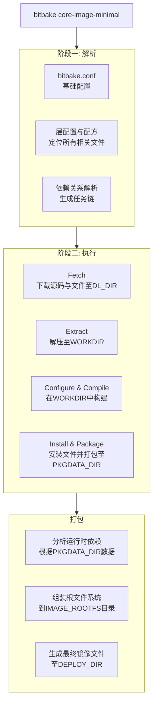
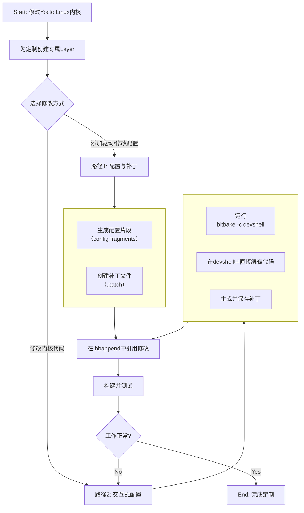

## STM32MP157 Intro(遗弃)

STM32MP157并非传统的单片机, 与我之前使用的STM32F103系列不同.

STM32F103 被称为MCU(Micro Controll Unit), 也就是微控制器.

STM32MP157 被称为MPU(Micro Processor Unit), 是微处理器.

不用太深入了解, 大概知道MCU主要是低功耗, 实时性强. MPU功能更强大就行.

Cortex-A7 + Cortex-M4 **异构双核处理器**. 也就是说, MP157同时拥有A7高性能核和M4的实时控制核.

针对两种不同核心, 其开发环境核工具链完全不同, 需要分别搭建.

下面是一些官方参考资源:

> [STM32MP157官方主页](https://www.st.com.cn/zh/microcontrollers-microprocessors/stm32mp157.html)
>
> [STM32MP1系列开发者wiki](https://wiki.st.com/stm32mpu/wiki/Main_Page)


## 开发环境搭建

### Win11+Ubuntu 22.04LTS虚拟机

由于A7核上一般会运行嵌入式Linux系统, 因此直接在Win下开发可能会有各种各样的问题, 而选择使用Linux环境进行开发, 工具链支持更好.

因此选择Win+Ubuntu虚拟机进行开发. 根据Yocto等开发工具的支持, 可以选择Ubuntu 22.04LTS或者24.04LTS两个版本. 不过24.04LTS会有一些恶心的权限设置问题(需要额外配置), 遂选择使用Ubuntu 22.04LTS版本.

在[PC_prerequisites](https://wiki.st.com/stm32mpu/wiki/PC_prerequisites#Virtual_machine_system)(ST官方维护的wiki文档)中, 给了一个可用的Ubuntu 22.04LTS的一个虚拟机, 该镜像是开源社区打包好的一个**预配置开发镜像**. 也可以直接从Ubuntu官方下载iso镜像来使用.(由于文档中的镜像下载太慢了, 我选择使用之前下载好的官方镜像).

先来试试看一个官方镜像该如何配置吧. 按照正常流程用iso镜像生成虚拟机.

ST官方文档推荐虚拟机的配置为

> CPU: 2颗核心及以上
>
> RAM: 6GB以及上
>
> 磁盘大小: 社区提供的虚拟机最大可以到500GB

```shell
sudo visudo

## 添加下面语句来避免每次sudo需要输入密码
usr_name ALL=(ALL) NOPASSWD: ALL
```


Yocto的开发一般在Linux下，准备Ubuntu22(适配yocto scarthgap版本)的虚拟机或者操作系统。


### Yocto 依赖安装

根据官方手册的`Quick Build`部分, 对部分依赖包的版本有要求:

```
Git			1.8.3.1 or greater
tar 		1.28 	or greater
Python		3.9.0	or greater
gcc			10.1	or greater
GNU make	4.0		or greater
```

另外还需要安装以下依赖包:

```shell
sudo apt install build-essential chrpath cpio debianutils diffstat file gawk gcc git iputils-ping libacl1 liblz4-tool locales python3 python3-git python3-jinja2 python3-pexpect python3-pip python3-subunit socat texinfo unzip wget xz-utils zstd
```


### 用Git 克隆 Poky

完成依赖包安装后, 可以创建一个`Yocto`目录来放置工程文件夹

```shell
mkdir Yocto
```

然后从官方克隆`Poky`

```shell
git clone git://git.yoctoproject.org/poky
```

得到的`poky/`文件夹就是一个`Yocto`项目的标准模板

```shell
cd poky
git branch -a
```

可以看到有很多不同版本的`poky`. 根据具体需要在我们的本地创建一个对应版本的分支, 比如这里我们选择`scarthgap`

```shell
git checkout -t origin/scarthgap -b my-scarthgap
git pull
```

这样我们就在本地创建了一个对应版本的`poky/`模板.

```shell
cd poky
git branch -a # 查看poky分支
git checkout -t origin/scarthgap -b my-scarthgap # 在本地创建scarthgap版本的poky分支
git pull # 拉取更新
```

### 构建镜像

在`poky/`下有一个`oe-init-build-env`脚本用来初始化工程构建环境

```shell
source oe-init-build-env
```

他会在`poky/`下创建`build/` 也就是构建目录. (这里初始化脚本可以自定义, 后续自己构建工程时为了工程结构分离可以更改`build/`的位置) 在`build/`目录下我们就可以使用`bitbake`命令了(前提就是要`source`我们的初始化脚本).

#### 自定义构建目录

 Yocto工程中涉及到很多`Bash`和`Python`脚本. 看起来会有些头疼, 比如我们可以自定义一个脚本来在**不变动原来的脚本情况**下, 更改我们的构建目录.

我们第一次可以:

```shell
source oe-init-build-env MY_BUILD_PATH
```

来将`MY_BUILD_PATH`作为参数传入脚本中, 让脚本在`MY_BUILD_PATH`目录下构建目录, 这里要制定具体的文件夹, 比如`./my-build`或者其他什么名字.

这样我们自定义的构建目录`my-build`就有了, 目录中的结构与默认的构建目录中一样.

但是`oe-init-build-env`脚本除了创建构建目录以外, 还会**初始化我们的`bitbake`环境变量**供Yocto工程使用. 所以每一次重新在终端中加载时还要进行繁琐的操作, 不如在自定义的`build/`下创建一个新的脚本来初始化环境.

比如创建一个`init-build-env`:

```bash
. /home/uesto/Yocto/secdisplay-scarthgap-stm32/sources/poky/oe-init-build-env /home/uesto/Yocto/secdisplay-scarthgap-stm32/build
if [ -n "$DL_DIR" ]; then
	BB_ENV_PASSTHROUGH_ADDITIONS="$BB_ENV_PASSTHROUGH_ADDITIONS DL_DIR"
fi
if [ -n "$SSTATE_DIR" ]; then
	 BB_ENV_PASSTHROUGH_ADDITIONS="$BB_ENV_PASSTHROUGH_ADDITIONS SSTATE_DIR" 
fi
export BB_ENV_PASSTHROUGH_ADDITIONS
unset TEMPLATECONF
```

第一行就是source我们的初始脚本, 并为其传入了构建目录

接下来就是一些条件判断(不细究, Bash语法不太懂).

这样我们就可以设置自定义的构建目录, 并且在每一次开启新的终端时, 利用这个脚本我们可以简化指令, 并让脚本完成初始化.

> 我们如果不输入自定义的构建目录的路径, 脚本是如何创建构建目录的呢? 这涉及到Bash脚本代码
>
> 具体来说就是在`poky/scripts/oe-buildenv-internal`和`poky/scripts/oe-setup-builddir`两个脚本中实现的, 由`oe-init-build-env`调用. 它们会检查是否传入了 自定义的地址, 如果没有, 就会设置当前工作目录(当前终端所在的目录)为构建目录`build`的地址.

---

## Yocto

Yocto是个啥? Yocto是个开源项目, 用来构建自定义的嵌入式Linux系统的. 它是一系列工具的集合.

我现在把它理解成一个**构建内核的工具包**. 可以利用VScode+插件来实现对Yocto工程的编辑与开发.

### 核心概念理解

Yocto核心组件包括:

* BitBake: Yocot的**任务执行引擎**, 负责解析元数据并执行构建任务.
* OpenEmbedded Core: 提供基础的元数据(如软件包配方和类), 它是Yocto的**核心**
* 元数据(Metadata): 包括了配置文件, 软件包配方(recipes)和类(classes), 定义了如何构建系统
* 镜像生成: 生成最终的Linux镜像文件, 包括内核, 根文件系统和用户空间工具.
* 层(layer): 元数据的文件夹, 它将不同功能或不同硬件的元数据分离开, 便于管理和复用

#### 配方

**配方**是一个很关键的概念, 一般都是`.bb`或`.bbappend`为扩展名的文件. 它来描述如何构建一个软件包(应用程序啊, 内核啊都可以, 甚至有一个很关键的就是**镜像**, 我们最后bitbake构建linux内核镜像时也是用一个`.bb`的镜像配方)

构建镜像时会使用`bitbake core-image-minimal`这样的命令, `core-image-minimal.bb`就是个镜像配方, `bitbake`根据该配方来构建镜像(哪些东西需要添加到镜像中等等).

#### .conf

**配置文件**是和配方息息相关的的. 大到对整个Yocto工程的配置, 小到对一个应用程序的配置都是通过`.conf`文件实现的. 

有几个比较重要的`.conf`文件:

* `bblayers.conf`. 一般在`build`文件夹下的`conf`文件夹中, 它是整个工程"层的开关", 只有加入到其中的层才是被启用的, 能够被`bitbake`扫描和使用

  > 在Yocto工程中, `bitbake`类似于`make`, 用来构建工程文件. 在构建过程中如何去定位我们工程所需要的配方? 是在`build/conf/bblayers.conf`文件中声明的. 在该文件中声明的层(比如`meta`, `meta-st-stm32mp`等等) 包含有各种配方在构建时就会被`bitbake`自动发现. 

  需要注意启动≠构建镜像时会包含, 具体还是取决于镜像配方是否包含该配方, 或者镜像配方包含的软件包是否"依赖"它.

* `local.conf`. 它也在`build/conf`下, 适用于整个工程. 用于定义当前构建的本地**个性化参数**, 也是当前构建目录`build`的**核心配置**.

  它可以指定目标硬件(项目构建的镜像运行在哪个开发板上), 限制构建资源, 控制编译优化等等. 

* `layer.conf`. 它存在于每一个层的根目录下(例如`meta-st-stm32mp/conf/layer.conf`). 用来定义层自身的属性的默认配置, 告诉Yocto如何处理该层的元数据. 里面包含有 层的优先级, 层的元数据路径, 层的依赖等等. 

  如果是官方提供的层, 则使用者无需修改. 如果是自定义的层, 则需要自行编写`layer.conf`

  ...

  (还有很多`.conf`, 比如全局配置`poky/meta/conf/`下的配置, 机器配置`machine/<机器名>.conf`, 发行版配置`distro/<发行版名>.conf`等等, 以后再了解)


#### 层

用来管理元数据的文件夹, 一般命名都是`meta-*`, 比如Poky的核心层`meta`, ST官方的为STM32MP1提供的BSP层`meta-st-stm32mp`, 或者我们自定义的层`meta-mylayer`.

配方的通用存放路线可以写为:

```
<层目录>/recipes-<分类>/<软件名>/<软件名>-<版本号>.bb
```


#### 构建目录(`build/`)

在初始化环境的时候我们会运行一个初始化脚本

```shell
source oe-init-build-env build-*
```

这样我们就会建立一个构建目录(`build-*`或者就是`build`). 并且进入该目录中, **这个目录非常重要**! 所有构建过程产生的文件都会存放在这里. **因此所有的`bitbake`命令也都应该在该目录下执行**! 不用关心配方啊层啊具体在哪里, 这些都会在`conf/bblayers.conf`中定义. 

#### 配方与配置文件的关系

`.conf`类似于"环境变量", 定义了全局可见的参数

而配方`.bb`就像是脚本, 运行在这些环境变量下, 可以使用也可以修改这些环境变量

**注意**: `.conf`中定义的变量, 默认对整个Yocto工程可见. 只是说不同的`.conf`文件的优先级不同, 因此定义同一个变量会存在优先级覆盖的问题.


我们配置好一个 8核CPU, 8GB内存以及150GB磁盘的虚拟机.

官方的开发工具不包括Yocto, 但是这里主要就是要使用Yocto.

我们在启动虚拟机之后需要单独配置Yocto.

Yocto官方网站给了快速构建的手册[The Yocto Project](https://docs.yoctoproject.org/).


### 比较重要的任务

在配方中给出了一系列处理软件包的任务流程. 下面是一些比较重要的任务:

* `do_fetch`: 构建一个recipe时, 首先就是要下载其软件包源码. 这个源码不一定非得从网络上下载, 如果我们之前已经在本地拥有源码文件, 那么也可以告诉recipe源码在哪里.

  > 可以通过修改对应recipe的`SRC_URL`变量来告知配方我们的源码文件在哪里

* `do_unpack`: 一般情况下下载的源码文件都会是压缩包, 所以很自然地需要去解压它. 这个任务负责解压包(如果是来自git仓库可能还需要检查修改或分支情况)

* `do_patch`: 给解压后的源码打补丁或者个性化修改

* `do_configure`, `do_compile`, `do_install`: 这三个任务按顺序执行, 但是有一些配方可能会略过某一个任务. 不同配方的差距明显, 对这些任务的环境变量定义大不相同. `Poky`提供了一些标准的类, 继承了这些类的配方可以直接使用那些 类定义好的任务.

* `do_package`: 将配方安装的文件划分为逻辑组件, 可以将软件打包成嵌入式设备上可安装的 安装包

* `do_roofs`: `Poky`一个很常见的用途就是生成根文件系统镜像. 根文件系统镜像应该被视为针对目标设备的可直接使用的根文件系统. 该镜像由一个文件系统构成, 也可能包括在其生成过程中需要使用的其他元素, 比如Linux内核, 设备树, bootloader二进制可执行文件或者其他文件系统. 


**任务是高度定制化的**. 对这些任务, 可以不运行, 可以添加细节, 也可以重写.


### 一些疑惑和解答:

#### `do_install`就好了, 为什么还要`do_package`?

我以为在构建镜像时, 内核镜像会直接包含所需要的各种软件的可执行二进制文件和依赖(按照合适的目录结构存放), 但是其实不是的. 按照我的理解, `do_compile`时就构建好了二进制可执行文件, 根本不需要后续的`do_install`和`do_package`. 

`do_install`其实就是在组织`do_compile`得到的二进制文件, 配置文件和库文件. 按照[目标系统的最终路径], 复制到一个**临时安装目录**, 大致意思就是, `do_install`的路径就和在目标系统中的路径保持一致. 那按照道理来说, **这一步不就实现了安装吗**? 干嘛还需要`do_package`?

`do_package`将软件再打包成`.ipk`包, 来供目标系统的根文件系统识别和使用. 如果直接把软件安装的目录直接给根文件系统, 其实存在大量问题, 比如软件的**依赖关系, 文件的权限, 软件可能有特殊的安装/卸载脚本, 版本信息**等等一系列**元信息**, 根文件系统无法知晓. 而`do_package`这一步在打包时, 就会将这些元信息包含进去, 实际上进行了一个**规范化/标准化**. 如果每一个软件都直接将自己的可执行文件目录拷贝给根文件系统, 根文件系统就完全无法管理这些软件. 而根文件系统通过`.ipk`的软件安装包来识别并管理这些软件, 实现了软件安装的**规范化**.

#### `do_rootfs`干了什么?

在`local.conf`或镜像配方(比如`core-image-minimal`)中, 会定义生成内核镜像所需的各类软件包(`IMAGE_INSTALL`). 在构建时`do_rootfs`就会去找这些软件包的`.ipk`(统一且规范)

将这些`.ipk`软件包解压到根文件系统目录中. Yocto会创建一个最终根文件系统的临时目录`${IMAGE_ROOTFS}`, 把所有的`.ipk`按照规范解压到该目录下. 这样做就会让目标系统启动时就能够识别到这些软件(类似于预装软件).

在这之后`do_rootfs`还会进行一些收尾工作:

* 生成`/etc/fstab`, `etc/inittab`
* 处理用户组(创建软件需要的用户/组)
* 清理临时文件, 压缩根文件系统(比如生成`rootfs.ext3`, `rootfs/cpio`等镜像格式)

最终`${IMAGE_ROOTFS}`目录就是"目标系统的完整根目录": 里面包含了所有软件的二进制, 库, 配置文件, 系统工具等


另外, **根文件系统的内容和格式是分离的**. `do_rootfs`处理了根文件系统的内容, `do_image`利用`IMAGE_FSTYPES`来确定文件系统的最终镜像格式. 这样我们的根文件系统内容只需处理一次, 后续如果要部署到不同平台, 只需更改根文件系统的格式就好.


#### tar的压缩包怎么是`.tar.gz`

`tar`只负责打包, 所以一般使用了tar的压缩包格式都是 `.tar.gz`, 也就是说压缩是用的其他方式.

`tar`只是将目录合并成功一个文件, `gz`就是使用`gzip`对其进行压缩


## 构建一个标准Yocto项目

### Yocto构建镜像的过程

整个构建流程可以概括为 **解析配置 -> 执行任务 -> 生成输出**. 




### 初始化构建目录

在拉取`poky`模板后, 我们需要在`poky/`文件夹下, 运行OE(OpenEmbedded, Yocto所基于的构建系统)的初始化脚本, 该脚本会创建一个全新的, 独立的构建目录(一般叫`build/`, 也可以自定义为`build-*/`)

```shell
source oe-init-build-env build
```

脚本运行后, 会自动切换到`build/`目录, 并且环境变量都设置完成.

**注意**: 这一步操作需要在每一个新的终端中进行一次, 来为终端加载环境变量.

### 配置: 编辑`build/conf/local.conf`

关键配置 `MACHINE ?= "qemux86-64"` (配置硬件, 如果是真实的硬件, 则需要匹配)

还可以配置并行线程数来加速编译: `BB_NUMBER_THREADS = "8"`, `PARALLEL_MAKE = "-j 8"`

### 为虚拟机配置代理

很多源文件都是外网源, 所以使用代理会加快下载.

本机使用的是Clash for Windows, 注意勾选`Allow LAN`来允许局域网访问, 这样虚拟机才可以用代理. 注意代理端口, 这里是`7890`.

然后就需要在Ubuntu虚拟机中设置

首先就是在GUI设置的网络里设置, 这里我们虚拟机利用nat共享主机网络, 主机和虚拟机在同一个网段里, 这里是`192.168.142.X`

主机的IPv4地址是`192.168.142.1`, 而虚拟机这里我们是`192.168.142.134`

因此在设置代理时为手动,http和https以及socks都填写上主机的IP地址以及端口号(7890). 这样虚拟机的浏览器就可以访问外网了.

但是命令行工具这个时候应该还无法使用, 所以我们可以

```bash
sudo vim /etc/environment
```

在最后添加:

```bash
http_proxy="http://192.168.142
1:7890"
https_proxy="http://192.168.142.1:7890"
ftp_proxy="http://192.168.142.1:7890"
no_proxy="localhost,127.0.0.1::1"
```

然后保存退出并`source`一下.

这样我们bitbake fetch时也可以代理了.


### 开始构建

使用`bitbake`命令构建一个目标镜像.

注意, 这些操作都需要我们在`build/`, 也就是构建目录下操作.

比如一个镜像配方叫作`core-image-minimal.bb`, 那么对应的构建命令为

```shell
bitbake core-image-minimal
```


### 运行结果

构建完成后, 输出文件在`build/tmp/deploy/images/<machine-name>/`下

可以使用QEMU直接运行对应的镜像:

```shell
runqemu qemux86-64
```


### 离线构建一个Yocto项目

现在以最小镜像为例, 我们需要现在联网的虚拟机设备上下载必要的Yocto工程文件, 然后拷贝到服务器虚拟机(未联网)上进行构建.

镜像在构建过程中会经历do-fetch->do-unpack->do->patch等等, 其中第一步do-fetch是在获取配方所需的源码, 这一步是需要联网的, 而后续的步骤都可以离线进行.

因此我们想要离线构建Yocto项目, 就可以针对某个我们需要的镜像, 仅仅先在线获取其配方源码, 然后将这些下载好的源码拷贝到离线虚拟机中进行构建. 

正常构建一个镜像可能是:

```bash
bitbake core-image-minimal
```

而这里我们则改为:

```bash
bitbake --runall=fetch core-image-minimal
```

语句的含义就是说仅仅是获取源码.

> ```bash
> git clone git clone git://git.yoctoproject.org/poky
> ```
>
> 下载速度可能会非常慢...
>
> 
>
> 可能因为是国外的源吧...


### 与硬件匹配

1. 需要找到官方或社区维护的BSP层(例如ST官方的`meta-st-stm32mp`)
2. 将其克隆到我们的源码目录中(比如和`poky/`同级)
3. 在`build/conf/bblayers.conf`中, 将这些层的路径添加到`BBLAYERS`变量中
4. 在`local.conf`中, 将`MACHINE`设置为该层支持的机器名(比如`MACHINE = "stm32mp15-eval"`)
5. 重新执行`bitbake`构建镜像.

> 在`local.conf`中, 发现关于`MACHINE`有
>
> ```
> MACHINE =
> MACHINE ?=
> MACHINE ??=
> ```
>
> 三种不同的语法都是Bitbake的变量赋值语法, 决定了变量值的**设置时机和覆盖优先级**. 
>
> * `=`: **立即赋值**, 无论之前是否设置过, 都立刻赋予新值
> * `?=`: **条件赋值**, 仅在变量当前未定义时才赋予新值. 若已经定义, 则保留原值. **解析时立即生效**
> * `??=`: **惰性条件赋值**: 仅在变量**最终未定义**(所有解析结束后仍无值)时才赋予新值. **解析结束时才生效**
>
> 注意`.conf`文件在工程全局和每一个层中都有, 会存在覆盖的问题, 因此有优先级. **后解析的层赋值会覆盖先解析的值**(当然也看具体的赋值语句).
>
> 一般在`local.conf`中不推荐使用`??=`, 这个一般位于发行版或基础层的`.conf`中, 用于**保底**.(例如`qemux86-64`), 来确保在任何情况下变量都有一个定义.
>
> 在`local.conf`中, 一般比较常见的用法是`?=`, 既能够提供我们想要的默认值, 又能够允许其他机制来覆盖它.


## 特殊的镜像配方 virtual/kernel

#### `virtual/kernel` -> 对应的配方

< 另外关于镜像的构建, `bitbake`提供了一个抽象层 `virtual/kernel`, 它用来标识一个Linux内核. 我们在构建时可以直接利用`virtual/kernel`来构建, 而不用硬编码一个具体的内核配方名称(比如`linux-yocto`等), 这样使得代码更通用, 也更容易移植和复用.

不同的硬件平台(BSP层)都可以提供它们自己的, 实际的内核配方, 通过依赖`virtual/kernel`, 构建系统能够根据当前项目的机器配置和启用的层, 来自动选择合适的内核配方.

**那么如何确定一个Yocto项目中`virtual/kernel`指定的是哪一个配方呢**? 一般是由**`PREFERRED_PROVIDER_virtual/kernel`**这个变量来决定的. 这个变量一般在机器配置文件(`.conf`)或者发行版配置文件(`.conf`)中设置. 

显然这个配置文件没那么好找到. 我们如何去寻找这个`virtual/kernel`呢?

使用`bitbake -e virtual/kernel | grep ^PREFERRED_PROVIDER`命令来找到配方名字

`bitbake -e`用于查看Bitbake的环境变量. 该命令会得到这样的结果:

```shell
PREFERRED_PROVIDER_virtual/kernel = "linux-stm32mp"
```

如果一个镜像配方想成为`virtual/kernel`, 需要用:

```shell
PROVIDES += "virtual/kernel"
```

来声明自己能够充当`virtual/kernel`的提供者.

我们现在知道了`virtual/kernel`的指定配方, 那么这个配方的位置在哪里?

```shell
bitbake -e linux-stm32mp | grep ^FILE=
```

结果就会显示该配方的路径信息. 

```shell
FILE="/home/uesto/Yocto/secdisplay-scarthgap-stm32/sources/meta-st-stm32mp/recipes-kernel/linux/linux-stm32mp_6.6.bb"
```

#### 如何设置镜像配方为`virtual/kernel`

我们现在通过`virtual/kernel`来反向找到我们的镜像配方.

那么如何设置一个镜像配方作为`virtual/kernel`,  让我们在`bitbake virtual/kernel`时明白构建的是我们想要的镜像?

在Yocto工程中, 我们想要一个配方作为`virtual/kernel`, 需要在配置文件中通过`PREFERRED_PROVIDER_virtual/kernel`变量设置. 可以通过`grep`命令来查找

```shell
uesto@uesto-virtual-machine:~/Yocto/secdisplay-scarthgap-stm32/build$ grep -r "PREFERRED_PROVIDER_virtual/kernel" conf/ ../sources/meta-*/
```

主要是在`build/conf`和`sources/meta-*`中去查找. 最终是定位到了

```shell
../sources/meta-st-stm32mp/conf/machine/include/st-machine-providers-stm32mp.inc:PREFERRED_PROVIDER_virtual/kernel ??= "linux-stm32mp"
```

这是一个`.inc`文件, 很可能被其他文件给`include`

我们一般会在`local.conf`中配置硬件设别`MACHINE`, 找到对应的`.conf`配置文件后发现的确在里面`include`了该文件

而一个配方要成为`virtual/kernel`需要满足:

* 配置文件`,conf`中使用`PREFERRED_PROVIDER`设置了它
* 配方中自己也是用`PROVIDES += "virtual/kernel"`声明可以作为`virtual/kernel`的实现.

我们现在满足了配置文件的设置, 配方中哪里设置了呢? 在`linux-stm32mp_6.6.bb`中没有显式设置该值. 配方`include linux-stm32mp.inc`, 这个`inc`文件与配方在同一个目录下. 该`inc`中`inherit`了多个类, 比如`kernel`, 这个几乎所有内核镜像都会继承的`.bbclass`中果然就有我们要找的

```shell
PROVIDES += "virtual/kernel"
```

至此, 我们明白了如何在抽象层`virtual/kernel`和具体的配方之间进行寻找.


由于`bitbake`并不支持很多文件查找的命令, 这里给出一些比较好用的查找命令

* `find 搜索目录 -name "文件名"`: 在目录下查找对应的文件

* `grep -r "搜索内容" 搜索目录 --include="文件类型过滤"`: 递归搜索包含特定内容的文件

如果要具体的查找Yocto里生效的变量, 建议再问问AI...


> 


## 定制Linux镜像

按照手册中的`Quick Build`部分, 生成的镜像只能用于模拟器`QEMU`. 想要生成一个可供特定硬件设备使用的系统镜像还需要进行一些额外的操作.

主要是要为我们的Yocto工程开发环境添加一个硬件层(hardware layer). 手册中告诉我们, 所谓层就是包含一些指令和配置的集合, 它们会告诉Yocto工程该做些什么. 根据不同的功能来将不同的层分开有助于模块化开发, 以及后续的层的复用.



### 工程结构

如何去组织一个Yocto工程? 在quick-build中如果按照默认选项进行操作, 那么所有的文件和资源都会被放在`poky/`下, 而`poky/`本身应该是作为Yocto工程的核心层, 而不是根目录.

因此需要调整我们的工程结构. 

这里以我构建的`stm32`工程为例, 该工程的结构如下:

```bash
.
├── build
│   ├── bitbake-cookerdaemon.log
│   ├── bitbake.lock
│   ├── bitbake.sock
│   ├── cache
│   ├── conf
│   ├── hashserve.sock
│   ├── sstate-cache
│   └── tmp
└── sources
    ├── meta-cetca
    ├── meta-openembedded
    ├── meta-qt6
    ├── meta-st-stm32mp
    └── poky
```

在`clone`下`poky`并且`checkout`到对应版本后, 正常情况下我们会执行`poky/`下的bitbake初始化脚本`oe-init-build-env`. 直接执行会在`poky/`下生成`build/`也就是构建目录. 这显然不是我们想要的.

想要实现上述结构, 需要执行如下命令:

```bash
cd poky
source oe-init-build-env ../../build
```

这样就会将构建目录创建在Yocto工程目录下, 和`source/`目录同级. `poky/`只是我们的核心层, 为了为我们的内核镜像添加一些定制化的驱动或者程序, 也是为了支持明确的硬件型号. 我们还需要去获取一些硬件厂商和其他厂商提供的自己的层, 甚至之后我们自己也会自定义层和配方, 这些统统都放在`source/`也就是源文件目录下. 

层的命名通常都是`meta-*`.

### 如何适配硬件

比如这里我们要为STM32MP157硬件构建一个可运行的Linux镜像, 我们需要:

1. 确认ST官方BSP层(meta-st-stm32mp)被正确地集成到Yocto环境中
2. 配置针对STM32MP157硬件的机器参数
3. 选择适合嵌入式场景的目标镜像
4. 构建镜像, 并且生成可烧录到硬件的文件

接下来就一步一步来:

#### 1. 集成BSP层

```bash
cd ~/stm32/build
```

```bash
vim conf/bblayers.conf
```

检查`bblayers.conf`中是否包含了BSP层的路径, 没有则添加:
```bash
BBLAYERS ?= " \
  ...
  ${TOPDIR}/../sources/meta-st-stm32mp \
"
```

这里`${TOPDIR}`是我们的`build/`目录的绝对路径, 也可以替换成绝对路径.


另外我们可能还需要一些其他的层, 比如`meta-openembedded`或者其他的自定义层. 也需要添加到`bblayers.conf`中.

值得注意的是, `meta-openembedded`是一个层集合, 该目录下还有很多层:

```bash
.
├── contrib
├── COPYING.MIT
├── meta-filesystems
├── meta-gnome
├── meta-initramfs
├── meta-multimedia
├── meta-networking
├── meta-oe
├── meta-perl
├── meta-python
├── meta-webserver
├── meta-xfce
└── README.md
```

我们根据需要将其中的层添加到`bblayers.conf`中.

#### 2. 配置目标机器(MACHINE)参数

继续在`build/`目录下

```bash
vim conf/local.conf
```

找到或者在文件的末尾添加`MACHINE`变量, 将其设置为STM32MP157对应的机器名称, 如果我们使用标准的`MACHINE`, 那么我们就可以从`stm32/sources/meta-st-stm32mp/conf/machine`目录下寻找可用的`.conf`文件, 对应的就是`MACHINE`名字, 我们在该目录下找到了:
```bash
.
├── include
├── stm32mp13-disco.conf
├── stm32mp15-disco.conf
├── stm32mp15-eval.conf
├── stm32mp1.conf
├── stm32mp21-disco.conf
├── stm32mp23-disco.conf
├── stm32mp25-disco.conf
├── stm32mp25-eval.conf
├── stm32mp2.conf
└── stm32mp2-m33td.conf
```

这里我们就可以使用`stm32mp15-eval`或者`stm32mp15-disco`. 它们分别是STM32MP157的评估板和探索版的`MACHINE`. 这里我们就选择使用`stm32mp15-disco`.

如果我们要自定义目标机器的话, 情形会复杂很多, 为了便于维护, 需要创建一个自定义的层, 并在其下自定义机器. 这里先不赘述.

那么就可以在`local.conf`中更新`MACHINE`值:

```bash
MACHINE ?= "stm32mp15-disco"
```


#### 3. 确定目标镜像

Yocto提供了很多预定义的镜像, 针对嵌入式硬件, ST官方也提供了一些适配的镜像或者基础镜像.

我们一开始可能不知道我们可以使用哪些镜像, 可以通过查找的方式来获取可用的镜像配方. 这里给出一种通过`bitbake-layers`命令的查看方法:

```bash
# 在当前build/目录下加载Yocto环境
cd ~/yocto/stm32/build
source ../sources/poky/oe-init-build-env . #注意末尾的点
```

然后使用`bitbake-layers`命令:

```bash
bitbake-layers show-recipes "*-image-*"
```

输出会显示每一个镜像属于哪一个层, 还有版本信息.


目前的meta-st-stm32mp层提供的镜像配方与以前的的似乎不太一样, 就像`MACHINE`也不针对具体的细分型号了, 只针对评估板和开发板两种. 这里的镜像配方甚至没有传统的"完整根文件系统镜像", 而是像`st-image-bootfs`, `st-image-userfs`等**分区镜像**. 

| 镜像名称              | 作用说明                                                     | 适用场景                                                     |
| --------------------- | ------------------------------------------------------------ | ------------------------------------------------------------ |
| `st-image-bootfs`     | **引导分区镜像**：包含 U-Boot 引导程序、Linux 内核、设备树（.dtb）等启动必需文件，是系统启动的 “第一阶段”。 | 必须构建，没有它系统无法启动。                               |
| `st-image-bootfs-efi` | 基于 EFI 启动模式的引导分区镜像（兼容 UEFI 固件），功能与 `bootfs` 类似，但启动方式不同。 | 仅当你的硬件使用 EFI 固件启动时才需要，默认开发板一般用 `st-image-bootfs`。 |
| `st-image-userfs`     | **用户分区镜像**：包含根文件系统（rootfs），是系统运行的核心分区，包含操作系统用户空间程序、库、配置文件等。 | 必须构建，提供系统运行的根文件系统（应用程序、命令行环境等都在这里）。 |
| `st-image-vendorfs`   | **厂商分区镜像**：用于存放厂商定制数据（如品牌信息、固件、配置参数等），非系统运行必需。 | 仅当需要存储厂商定制内容时构建（可选）。                     |

我们要构建一个可启动的STM32MP157系统, 至少需要`bootfs`和`userfs`. 

镜像构架完成后会生成在

```bash
build/tmp/deploy/images/stm32mp15-disco
```

目录下, 如果要将其合并为可以烧录到SD卡或eMMC的完整镜像, 通常还需要`wic`工具, ST层一般是提供`wic`脚本的(位于`meta-st-stm32mp/wic/`目录下)

这种拆分可能是便于独立更新 引导程序, 内核或者根文件系统. 


#### 4. 构建镜像并生成烧录文件

目前我还没有硬件, 烧录文件这一步暂时搁置.

对于构建镜像, 我们需要将源码先下载到本地, 然后再迁移到服务器虚拟机中进行构建. 如果直接运行:
```bash
bitbake st-image-*
```

那么bitbake会执行整个构建流程, 包括很多中间文件, 整个项目会非常大. 迁移起来非常痛苦.

因此这里我们仅仅需要将源码下载到本地, 后续的构建流程在服务器上完成就行:
```bash
bitbake --runall=fetch st-image-*
```


### MACHINE和镜像的关系

`MACHINE`通常指硬件配置或架构, 而`image`则是操作系统镜像, 需要考虑硬件兼容性.

镜像需要根据硬件架构以及外设来选择合适的操作系统镜像.


### 自定义层

